# Environment register bake-off (#91)

Two treatments of **one** grime-market board, under one camera, one
projection, one palette, one unit layer. The register is the only variable.

- **A — SVG→raster comic-book** ([#66](https://github.com/arnavp103/hazard-pay/issues/66)'s
  standing ruling): ink-like outer contours, clean internal separations,
  flat cel-shaded colour clusters, graphic shapes.
- **B — MST register**: dense illustrative pixel, clustered shading,
  layered props and clutter, warm lived-in surface, ground plane readable
  under a busy scene.

Both are programmatically authored. No image models, no paid APIs, no
hosted services, and no new dependency — `pnpm-lock.yaml` is untouched.

## Why the comparison is trustworthy

"Same board" is enforced by construction, not by eye:

| Shared | Where |
| --- | --- |
| floor plan, prop manifest, projection, cameras, unit roster | `board-model.ts` |
| every prop polygon and its resolved colour | `prop-geometry.ts` |
| the 51-colour palette | `palette.ts`, gated by `palette.test.ts` |
| the placeholder unit layer | `compose.ts` + `unit-sprites.ts` |

Treatment A turns those polygons into SVG paths and inks them. Treatment B
scanline-fills the identical polygons into a pixel buffer and runs its own
surface passes over them. `palette.test.ts` fails if either treatment emits
a colour outside the shared set; `board-model.test.ts` fails if a camera
stops being a whole-number scale or a prop wanders into the walkable aisle.

## Capture protocol

Deterministic, driven by query params on `/env-register`:

- `combat` = 2× of a 640×360 aperture → 1280×720
- `crowd` = 1× of the full 1280×720 board → 1280×720
- both framings emit the same capture size, and both scale by a whole
  number, so treatment B is never resampled
- units, tier filter, ambient frame, and treatment B's layers are all
  switchable, so every image below is reproducible from a URL

## The stills

### Controlled still — treatment A, combat zoom

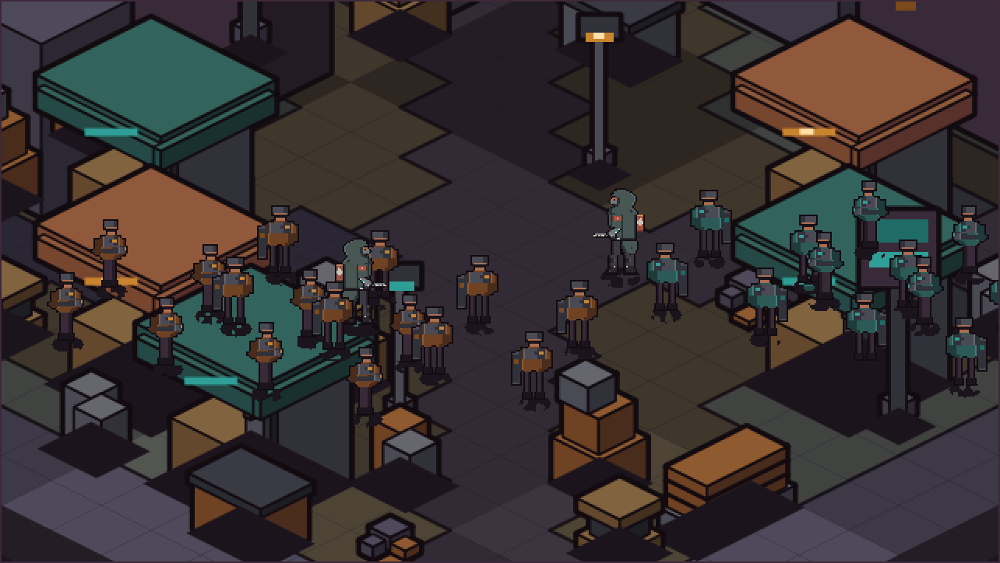

### Controlled still — treatment B, combat zoom

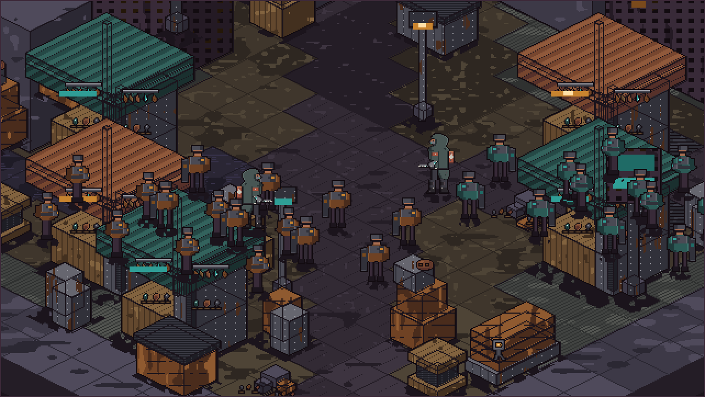

### Direct side-by-side at combat zoom

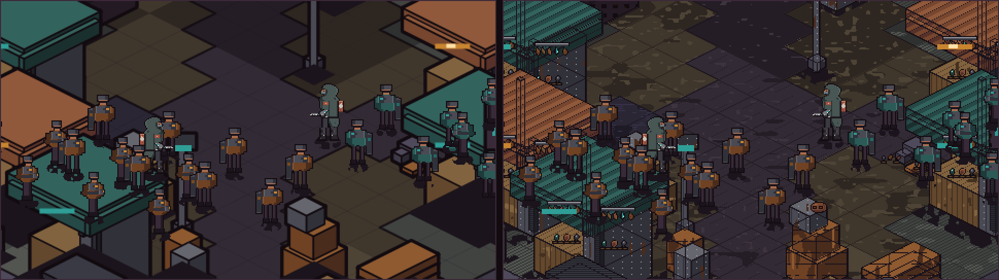

A left, B right. Identical aperture, identical roster, identical palette.

### Crowd scale

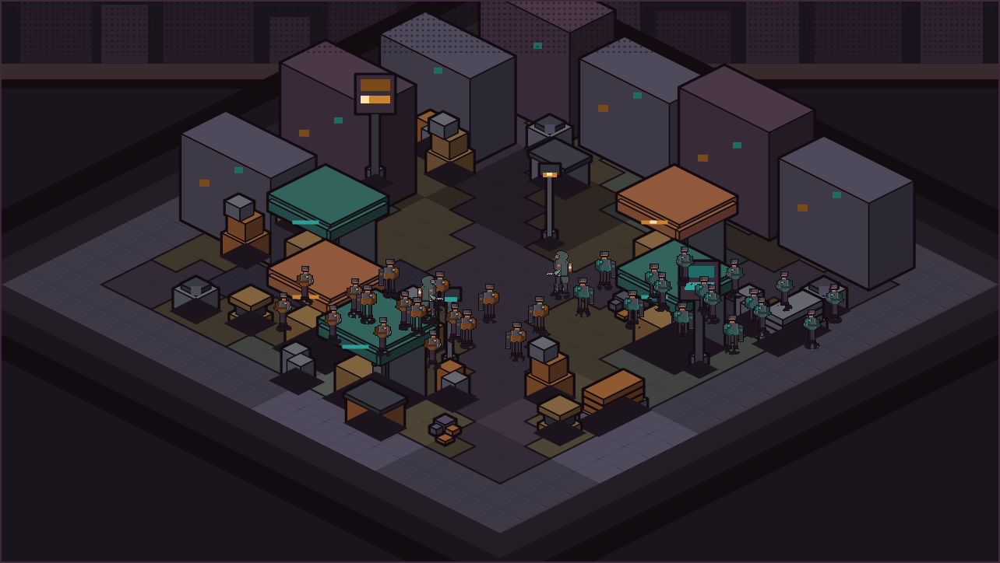

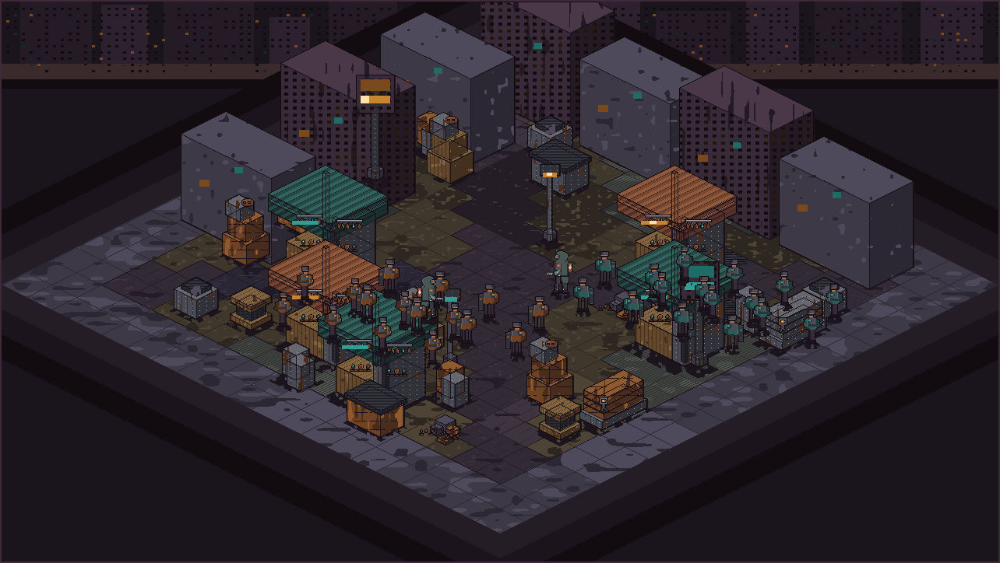

34 placeholder units — 1 hero and 16 fodder per side, two fodder
archetypes. Hero 48×64, fodder 38×50: the "slight size boost" ratio
(≈1.26×) from the tier-separation ruling, with no marking, since marking
was explicitly deferred.

### Board without units

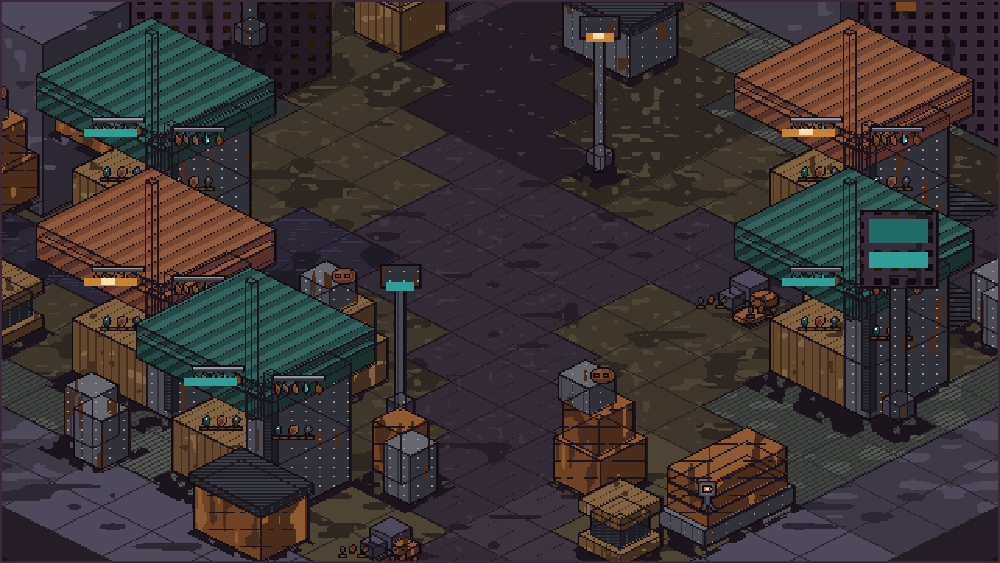

### The environment alone, at hero scale

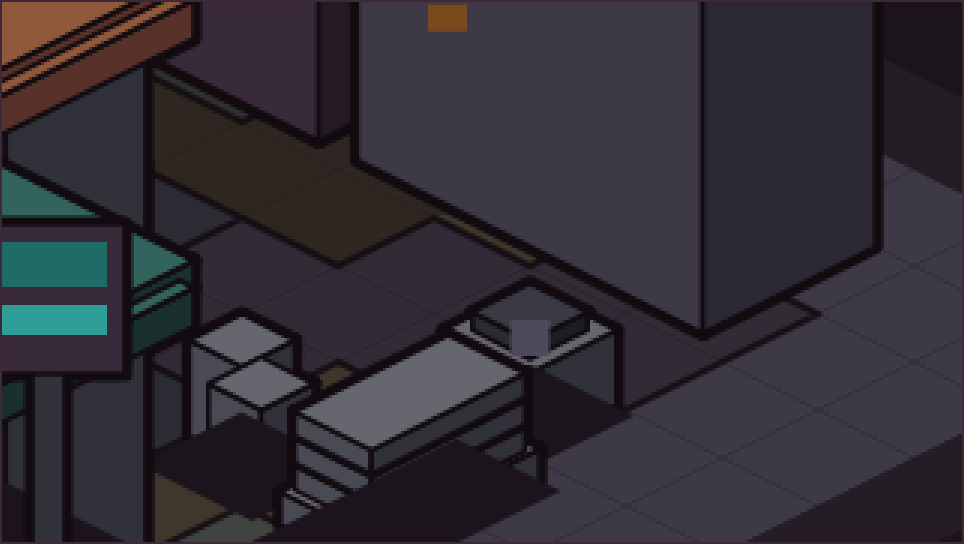

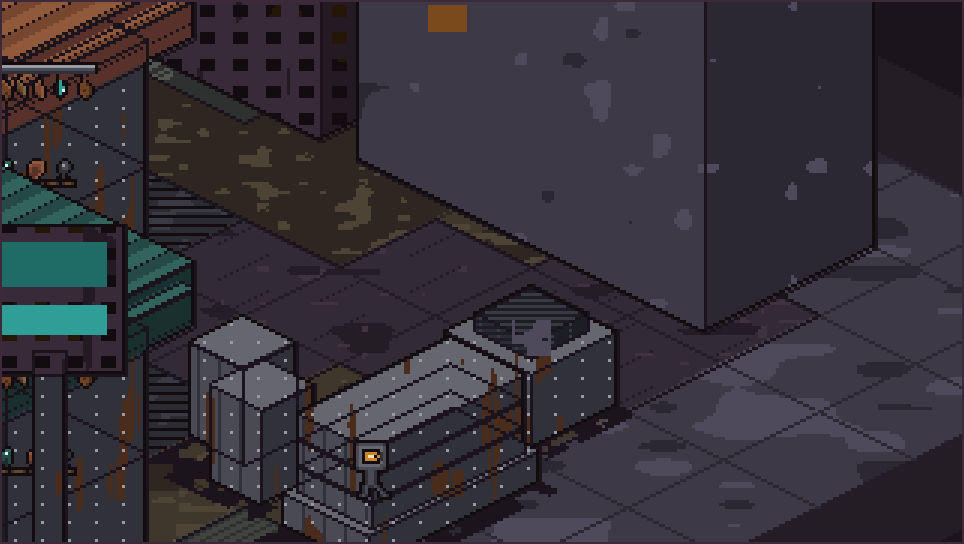

## The production-risk exhibits

### Treatment B's three layers

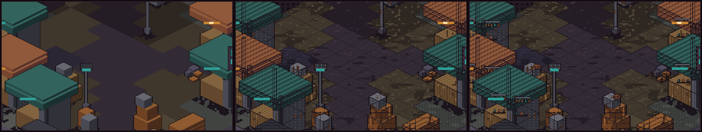

Left: shared geometry only. Middle: plus the generated surface passes.
Right: plus the five hand-authored stamps.

The middle step touches **123,699** pixels. The right step touches
**4,702**. Generated passes produce *surface*; only the authored grids
produce *objects*.

### Authored vs generated, same prop

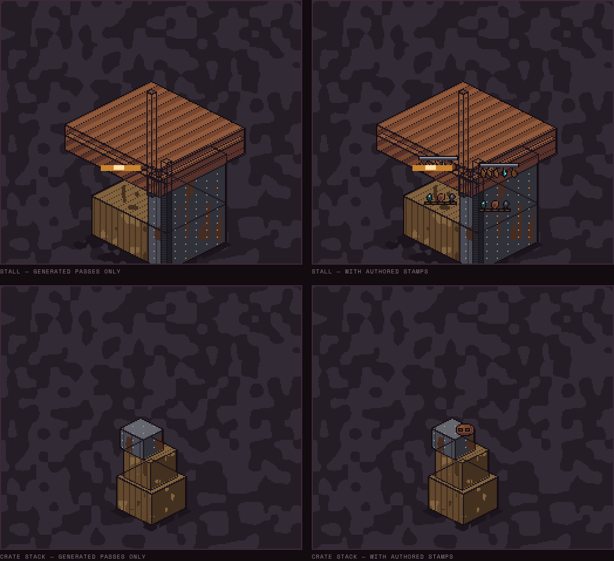

Same geometry, same palette, same shading. The only difference is whether
a human-equivalent hand typed a grid for it.

## Ambient

Both treatments run the same six-frame ambient schedule: a mains flicker on
the amber signals, a slower breathing teal, and three staggered vent puffs.
Flicker steps *down the emission ramp* rather than blending an alpha, so
every frame stays palette-conformant.

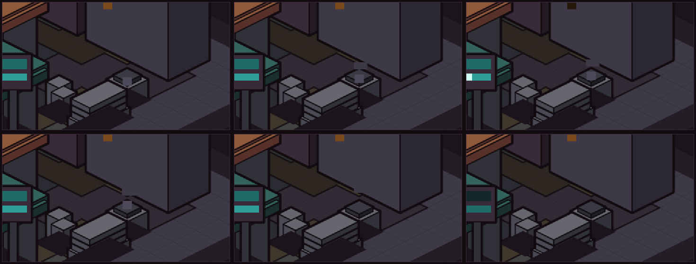

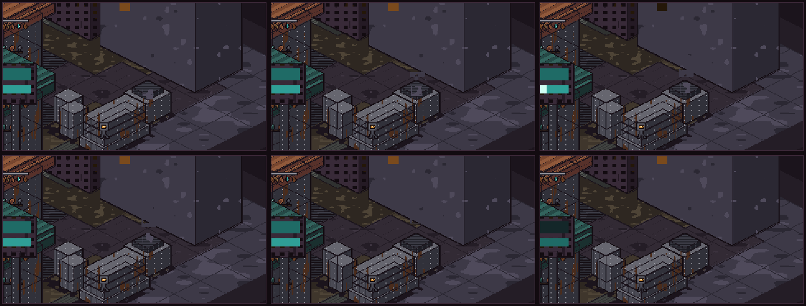

The ambient layer is deliberately minimal. Environment animation is its own
open question ([#70](https://github.com/arnavp103/hazard-pay/issues/70));
this only demonstrates that the schedule is shared and reproducible.

## Treatment A's free zoom

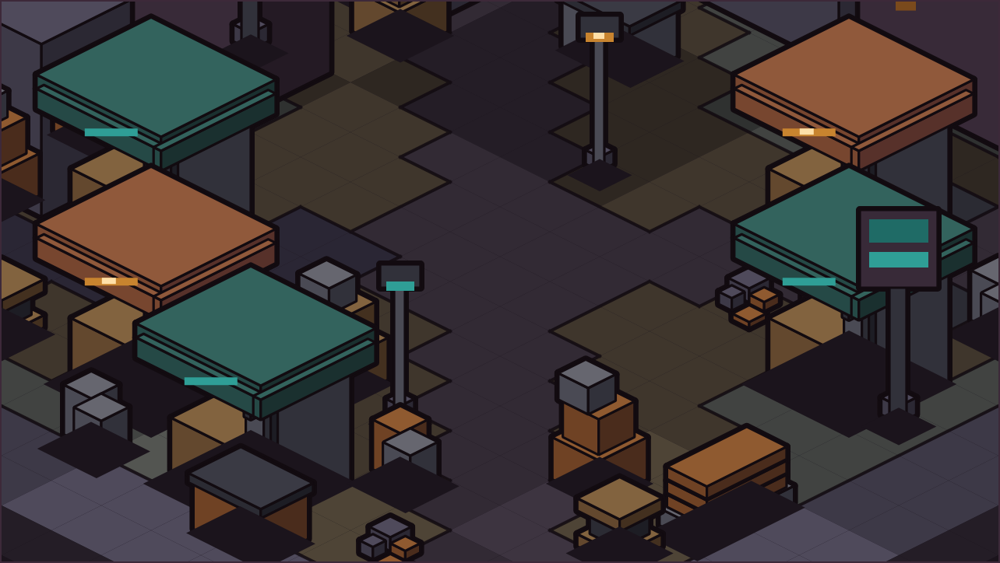

The same SVG rasterized at the camera's output resolution instead of the
board's. Treatment A gets zoom levels for free; treatment B would need an
authored LOD per zoom step. That is the #69 zoom-cost argument showing up
inside the environment lane.

## Cost report

`cost-report.json`, with the measured numbers behind everything above.

## Round 2 — cold-critique response

A provenance-cold critic saw only these images and the reference board.
Its verdict: **treatment B's register should govern, conditional on the
walkable plane being held to treatment A's contrast discipline.** The
images above are post-fix; `cold-critique.md` is the critique verbatim.
What changed:

- tile seams are drawn last, so the dimetric grid survives the wear pass
  across the whole fighting area
- wear became directional — floor smears run along the traffic axis, wall
  stains run downward as drip runs — instead of one round blob at every
  scale
- canopy ramps were desaturated below team-identity colour, and unit cloth
  moved to its own ramp, so the awnings stop being the most saturated
  objects on the board
- stall posts were thinned and darkened so they stop cutting unit
  silhouettes
- the junction-box stamp moved off building faces, where it read as a
  figure at building scale, down to ground level beside the pipe racks

## Not production art

Throwaway prototype. The hero is borrowed lane art from
[#74](https://github.com/arnavp103/hazard-pay/issues/74) and the fodder are
generated placeholders — characters are explicitly not this lane's
variable.
