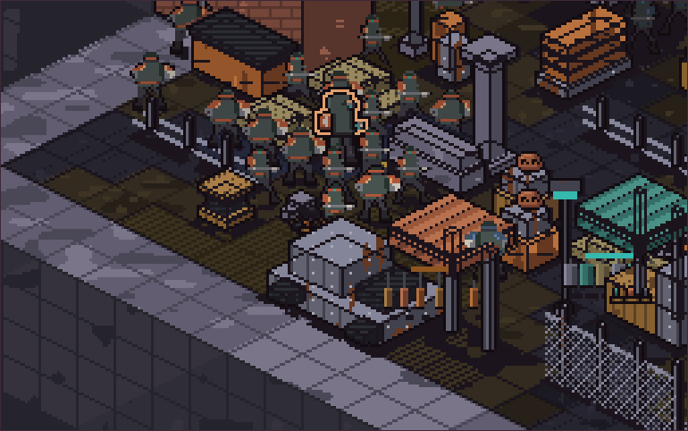
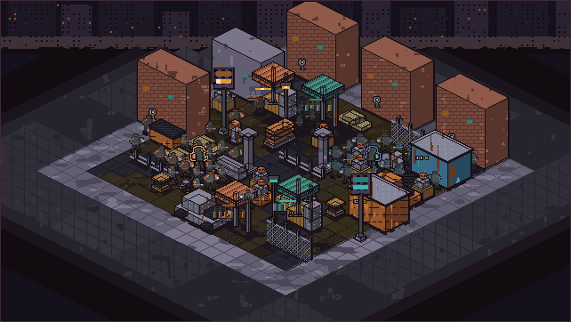
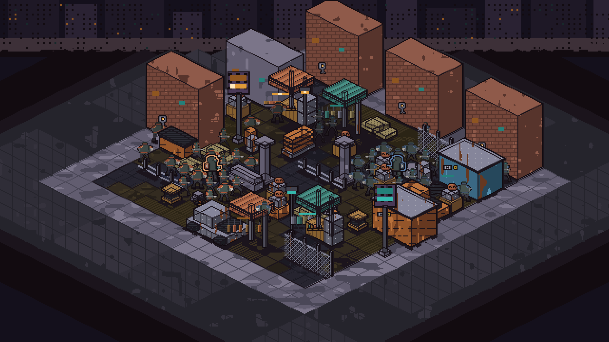
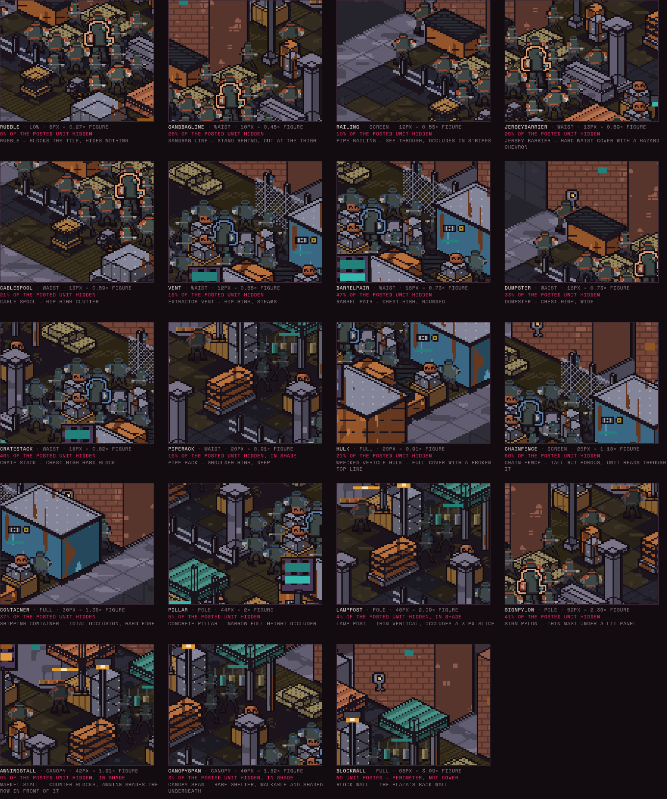
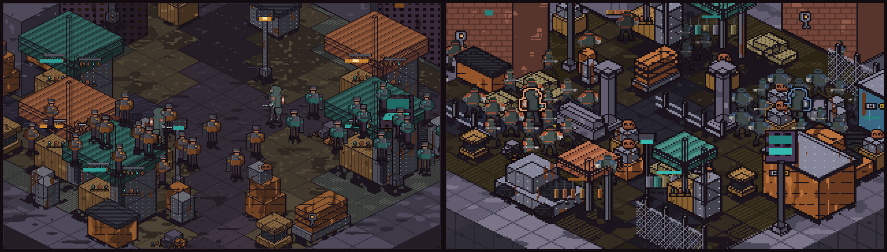
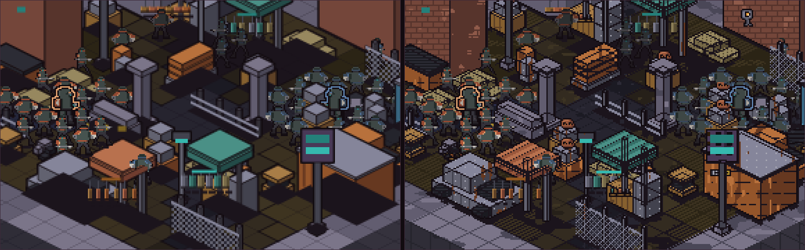
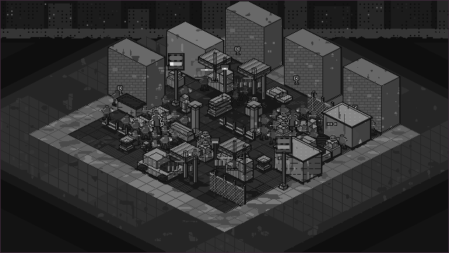
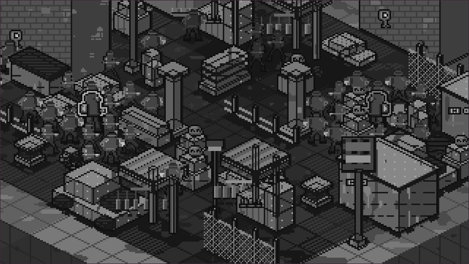

# Environment register — round 2 (#91)

Round 1's feedback was four separate problems. This round answers all four,
and three of them turned out to be one bug.

## 1. Units were standing ON cover — fixed structurally

Round 1 rendered the board to one canvas and the whole unit roster to a
second, then drew the second over the first. Under that pipeline **every unit
is in front of every prop by construction**; no sort inside either layer could
have helped. That is why the round-1 capture has figures on crate lids and
stall roofs.

Round 2 replaces both halves:

- **Occupancy** (`occupancy.ts`). Props claim whole floor tiles; units may only
  stand on tiles no prop claims. Placements are *derived* from that model
  rather than authored, so a unit on a prop is unrepresentable, not merely
  unintended. Cells under a roof stay walkable — a canopy is a lighting fact,
  not a blocking one.
- **One painter order**. Props and units go into a single topological sort, and
  units composite against a depth index built from the *shared* prop geometry,
  so occlusion is identical in both treatments.

The occlusion predicate needed a repair the textbook form does not mention.
`a.x0 >= b.x1 || a.y0 >= b.y1` makes every mutually-diagonal pair a 2-cycle,
and on a plaza-shaped board that left **0 of 79 items with in-degree zero** —
the topological sort silently degraded into the naive comparator it was written
to replace. Such pairs are screen-separated, so the fix is to claim no ordering
for them at all.

Asserted mechanically in `occupancy.test.ts`:

| Assertion | Result |
| --- | --- |
| no unit foot anchor on a prop-occupied tile | 41/41 |
| props and units interleave in ONE order (not two stacked layers) | pass |
| a nearer footprint is always painted after a further one | pass, all pairs |
| at least one unit genuinely partly occluded | 35 of 41 cut |
| units posted in *front* are not occluded by what they stand before | pass |

## 2. The latest SMALL units

`borrowed-crowd-small.ts` carries the pixel lane's round-4 grids verbatim
(`prototype/pixel-control-lane`, head `2cbaf718`) — breaker and stinger at a
22 px figure, Mara at 28 px. **The board was rescaled to a 28×14 tile for
them**: round 1 drew a 64×32 tile under a borrowed 48×64 hero, and a 22 px
unit on a 64 px tile reads as a beetle on a dance floor. Native resolution is
now 640×360, so "true 1×" means one authored pixel per screen pixel.

Their round-4 rendering policy is ported too — grids are material-only and the
contour is applied at blit time against whatever is actually behind the unit —
which is what lets this lane measure its **own** figure/ground number instead
of inheriting one.

## 3. The "dots" — wares with form, and evidence of a ceiling

Round 1's `stallGoods` grid was 34 wide, one mark, one value, one size, evenly
spaced. That is a texture, and texture hung in the air over a figure is exactly
the "no perspective / depth under the ceiling" read. It is **retired**, not
rescaled. Hanging goods are now shared *geometry* (`hangingWares`): varied
sizes, a per-bundle lit/base/shadow ramp with an ink underline, mutual
occlusion along the rail, and a cast shadow onto the surface below.

Being under cover is now stated three ways: the floor steps one rung down its
own ramp under a roof and inside the roof's cast shadow, that shadow gets a
drawn edge so it reads as a shape a specific roof threw, and a unit whose foot
tile is in shade renders one further step down. 21 walkable tiles are in shade.

**Roof depth is capped at two rows, and that is not a style choice.** A flat
roof projects down-screen as it approaches the camera; at lift 34 a roof four
tiles deep puts its own front edge at a unit's ankles and the unit reads as
standing on it — round 1's complaint arriving by a different route, which the
first round-2 build reproduced exactly. The near edge clears a figure's crown
only while `lift − 14 × (tiles in front) > figure height`. Hence shallow, wide
canopies and more of them. The honest next move is a *pitched* roof whose near
edge is raised independently; not built here.

## 4. Cover variety — the sheet

Nineteen cover kinds across six classes (`low`, `waist`, `screen`, `pole`,
`full`, `canopy`), each authored against the 22 px figure rather than the tile.
The sheet is **crops of the real board**, not a neutral diorama: every panel
has a real unit posted behind that cover, in the shipped scene, through the
real occlusion pipeline, with the measured share of that unit hidden.

### What reads best at 22 px

**Unambiguously "behind", best first:**

1. **Crate stack** (18 px, 0.82× figure) — 40 % hidden. The single clearest
   read on the board: a flat hard top line cuts the figure at the chest and the
   head sits proud of it. Hard-edged waist cover is the winner.
2. **Barrel pair** (16 px) — 47 % hidden, and the rounded top line is *worse*
   than the crate's flat one at this size; the curve costs the cut its clarity.
3. **Jersey barrier** (13 px) — 26 %. The hazard chevron gives the top edge a
   value change to cut against, which matters more than the height does.
4. **Shipping container** (30 px, 1.36×) — 37 % only because the post sits on
   its corner; dead behind it the unit is simply gone. Full cover reads
   instantly but it reads as *absence*, which is a different affordance.
5. **Sandbag line** (10 px, 0.45×) — 25 %. Soft silhouette, but the cut lands
   at the thigh where the sprite is two separate legs, so the read is good.

**Ambiguous or weak at 22 px:**

- **Rubble** (6 px) — 0 % hidden. Blocks the tile, hides nothing, communicates
  nothing. It is scenery pretending to be cover.
- **Pillar** (44 px) and **lamp post** (46 px) — 5 % and 4 %. Tall and *narrow*
  is the worst combination: the occluder is a vertical sliver, so the unit
  looks damaged rather than covered.
- **Chain fence** (26 px, screen) — 60 % hidden through the lattice. Legible in
  isolation and mush inside a crowd; the wire competes with the sprite's own
  contour at this size.
- **Canopy** — 0–3 % occlusion by design. Its claim is shade, not cover, and it
  only lands because the floor and the unit both darken.

**The finding:** waist-height, hard-edged, flat-topped, and *walkable-adjacent*
is what the scene was missing. The cofounder's instinct was right — cover you
stand behind carries the spatial read; cover overhead does not, and cover
that's too tall or too thin carries nothing.

## 5. Readability

Round 1 left, round 2 right, same aperture.

Round 1 put the whole frame in one value band — ground 36–60, props 59–77,
borrowed unit coat 79 — so nothing separated from anything. `palette.ts` now
authors four declared value zones and `palette.test.ts` pins them, so a future
round cannot quietly flatten the frame again.

| Measure | Round 1 | Round 2 | Canon / note |
| --- | --- | --- | --- |
| body / identity / emission | 93.1 / 6.2 / 0.48 | **83.1 / 16.4 / 0.42** | 70 / 25 / 5 |
| single largest value zone | backdrop 45 %† | **ground 30.6 %** | flat frame = one zone |
| luma P5–P95 span | 90† | **107** | of 255 |
| interquartile range | — | **39** | |
| figure/ground dissolve | not measured | **24.7 %** | own pipeline |
| contact-zone ink (separate) | — | 33.2 % | always inked, not a dissolve |

† recomputed from round 1's buffer for comparability.

**Identity moved 2.6× but is still 16.4 %, not 25 %, and that gap is real.**
It was closed by dressing the board in identity-band material — brick
perimeter, wood and rust cover, canvas canopies, warm stall matting — and by
running the apron out to the frame corners as lit pavement instead of letting
it fall to ink. It was *not* closed by re-banding: matting changed band because
its colour changed from neutral grey to warm fibre. The remaining gap is
structural: the walkable plane and the sky are 57 % of the frame and both are
body by definition, so a board cannot reach 25 % while the plane stays quiet.
That is a canon question, not a rendering one.

**Figure/ground dissolve is 24.7 % on this pipeline** — measured here, not
inherited. It was 52.8 % before the ground ramps were pushed down: the borrowed
unit's coat sits at luma 79 and its trousers at 56, so any floor climbing into
the fifties dissolves the figure. Every ground step is now held at or below 58.
The contact zone (33.2 %) is counted separately because this lane inks it
unconditionally; folding it in would inflate the number by a quarter and make
it incomparable with the sibling lanes' 53 % and 4–7 %.

## The A/B comparison, preserved

Treatment A left, treatment B right — same board, same units, same occlusion,
same palette. Round 2 makes the control *stricter* than round 1: both
treatments now hand their finished 640×360 board to the same compositor, which
cuts units against the shared geometry and inks their silhouettes against
whatever that treatment actually drew.

Full-frame stills: [A 1×](a-native-1x.png) · [A 3×](a-native-3x.png) ·
[B 1×](b-native-1x.png) · [B 3×](b-native-3x.png) ·
[A combat 3×](a-combat-3x.png) · [B combat 3×](b-combat-3x.png)

## Grayscale

## Known limitations

- **Roofs do not occlude units.** A roof at lift 38 genuinely *can* clip the
  crown of a unit several tiles behind it; here it will not. Solving it
  properly needs per-piece footprints and a height field. Without the
  exemption, every unit under a canopy is erased by the ceiling above its own
  head, because the whole prop sorts at its column's depth.
- **Two cover-sheet panels are occluded by a neighbour rather than by their own
  exemplar** (`cover-hulk` by a crate, `cover-signPylon` by a barrel). The
  posts are generated from the occupancy model and the plaza is crowded; the
  percentages are real but those two are not measuring what their label says.
- Heroes (28 px) are marginally clipped by a canopy's near edge where fodder
  (22 px) is not — the depth cap was solved for the fodder figure.
