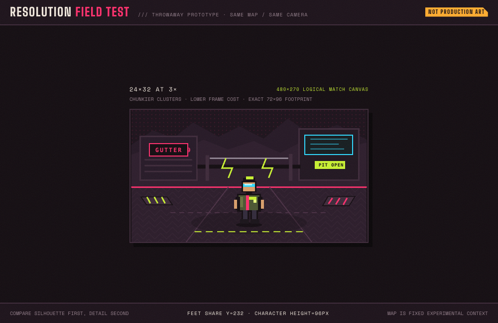

# Character-resolution map prototype

Throwaway evidence for the character-resolution decision in
[Decide: pixel-art canon for Direction B](https://github.com/arnavp103/hazard-pay/issues/68).

The study holds the 480×270 map, camera, palette, lighting, ground line, and
96-pixel character height constant. Only authored resolution and integer render
scale change:

- `A` — 24×32 authored pixels rendered at 3× (72×96 screen footprint)
- `B` — 32×48 authored pixels rendered at 2× (64×96 screen footprint)
- `C` — both candidates on the same map and ground line

Open `/match-proto?study=resolution&variant=A` and use the floating arrows or
keyboard left/right keys to switch. Add `capture=1` to hide the switcher.

The SVG map is experimental context for judging the sprites, not a ruling on
the separate pixel-characters-over-cartoon-environments cohesion question.

## Gallery

### A — 24×32 at 3×

### B — 32×48 at 2×

### C — same-map lineup

Captured with `agent-browser` at a fixed 1000×650 viewport with `capture=1`.
