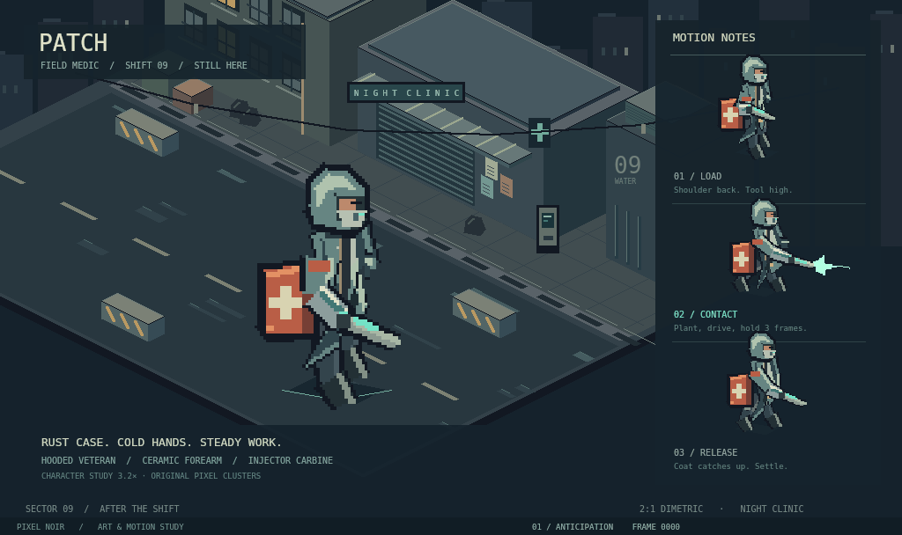
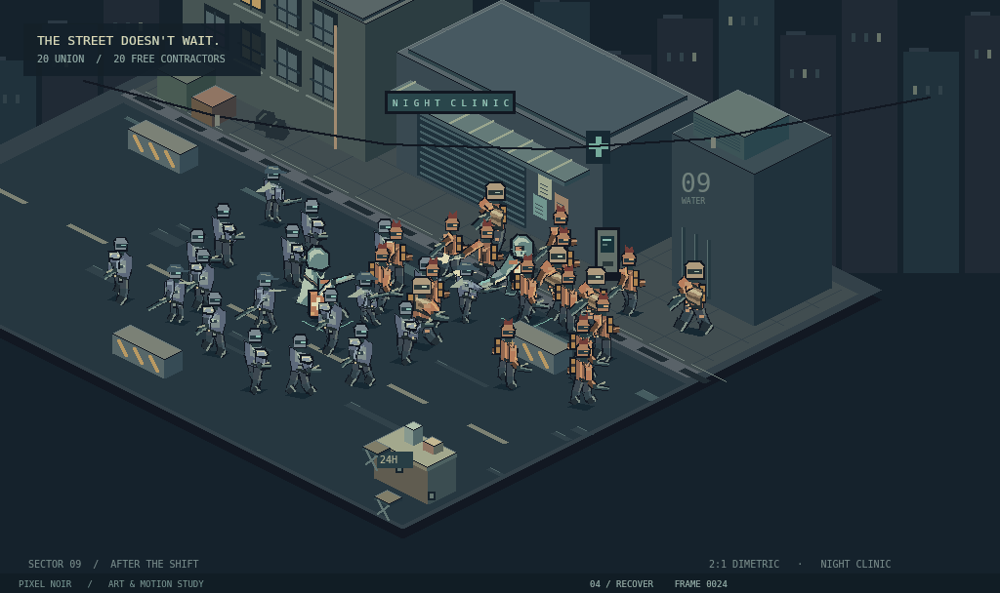
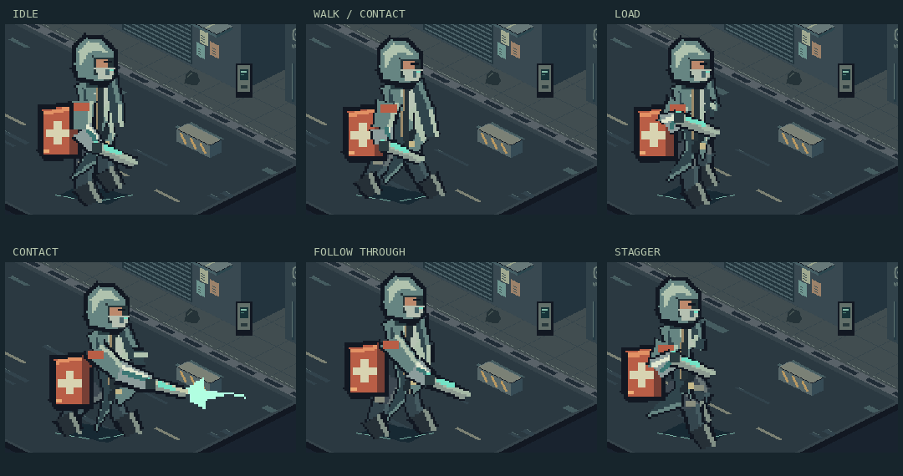

# Pixel Noir — the night shift

A self-contained, throwaway art and motion direction for Hazard Pay. Route:
`/pixel-noir-prototype`. No external service, asset downloads, or game simulation
are required. The existing combat sandbox is untouched.

## Offline gallery

These previews execute the actual `painter.ts` and `motion.ts` through native
`@napi-rs/canvas`. They are **offline renders, not browser screenshots**. The
interactive route could not be browser-verified in the execution environment.







[Hero still](gallery/hero.png) · [Lineup](gallery/lineup.png) ·
[Crowd still](gallery/crowd.png) · [Idle / walk / turn / stagger reel](gallery/hero-motion.gif)

The secondary motion reel shows two seconds each of idle, walk, turn and stagger.
The turn segment samples model time at 3× to display all eight facings; this is
an explicitly edited reel, not a continuous real-time session. The crowd GIF is
an excerpt, so its end-to-start cut is not a promised seamless animation loop.

## What to judge

Patch is a hooded field medic: split storm coat, oversized rust medical case,
ceramic forearm, cold injector light, compact masked face. The pale material on
his arm and the rust kit are deliberately reserved for his identity. Guards have
closed armour and a low helmet; raiders have a high crest and exposed air tank.
The three featured characters are different contours, not palette swaps. The
crowd also includes low-cap scouts with scarves and long rifles, and stockier
welding-mask bruisers. Hero medics use a lighter hood, wider split hem, and 1.08×
crowd scale; ordinary troops are 0.8×, scouts 0.74× and bruisers 0.9×.

The clinic street has deliberately built depth: shutter slats, crooked gutter,
roof plant, awning, shop sign, window mullions, garbage sacks, terminal, road
markings and wet patches. A subdued blue-grey environment leaves the strongest
material contrast to characters. The camera uses exact 2:1 dimetric projection:
`screenX = x - y`, `screenY = (x + y) / 2 - z`.

## Lineage and deliberate changes

- PR #84 / `prototype/pixel-control-lane`: carry forward the hooded field medic,
  material-local pixel clusters, rust kit and teal injector. This branch starts
  fresh with its own drawing and motion code, rather than importing prior grids.
- PR #88 / `prototype/blender-baked-lane`: retain its test of coherent character
  volume and action poses, while exploring native pixel authoring instead of
  Blender baking. PR #76 / `prototype/character-resolution-map` supplies the
  medium-resolution silhouette question. The ~80 px native character has a visible split hem,
  separate feet, angular mask and recognisable kit. A larger 1024×608 aperture
  avoids crushing the entire scene into the old 480 px framing. This is a visible
  experiment, **not a stealth change to the game's resolution contract**.
- PR #92 / `prototype/environment-register`: the street carries a consistent
  material vocabulary and dense environmental storytelling. It is built locally
  from deterministic pixel geometry; no assets are copied from that lane.
- `docs/research/reference-board-characters.md`: comic contour hierarchy,
  exaggerated action phrasing, material-local palettes and controlled detail.
  The linked commercial art is reference only; nothing is downloaded or traced.

## Authoring and animation

`painter.ts` implements integer scanline polygon fills. Character contours,
shadows and highlights are explicitly arranged shapes. A small articulated pose
model supplies joint anchors; each resulting drawing is first rasterized on a
180×116 transparent local canvas before nearest-neighbour presentation. This
is **procedurally drawn, stepped pixel animation**, not hand-drawn unique frames,
3D baking, a sprite-sheet import, or an image-model output.

`motion.ts` owns deterministic 12 fps exposures. Attack has four phrases:
anticipation (lean back and lift), contact (plant and extend with a three-frame
hold), follow through (coat trails), and recovery. Walk changes feet, knees,
hips, arms and coat. Turn displays eight quantized facings. Stagger pulls the
body off balance and braces with the free arm. The independent crowd cycles
between patrol, engagement and withdrawal. Foot lift and arm swing exist at
native scale; effects only fire on contact exposures.

## Controls and capture

- Hero: enlarged 3.2× character study beside three labelled attack key poses.
- Lineup: three distinctly equipped silhouettes at 3× for direct comparison.
- Crowd: 40 autonomous deterministic timelines, including two medics and five
  distinct kit silhouettes, with role-dependent scales described above.
- Idle / walk / attack / turn / stagger buttons operate hero and lineup.
- Play, pause, **Step +1** and timeline scrubber work without a browser console.
- Rain toggles environmental motion independently.
- `?view=hero|lineup|crowd&anim=attack&freeze=667&capture=1`: deterministic frozen
  milliseconds; `capture=1` reduces outer notes but preserves accessible controls.
- Default is live hero attack. `freeze=0` correctly freezes the first frame.

Development: `corepack pnpm --filter @hazard-pay/webapp exec vite dev --port 5175`.

## Limits

This tests the visual direction and animation grammar. The crowd is a timed
illustration with forty independently offset patrols, not combat AI, pathfinding,
cover selection, damage or production gameplay. It has no win state. Unit paths
are staged to clear fixed barricades, with a full-cycle clearance test. They may
cross each other; contact effects demonstrate phrasing rather than hit correctness.
Foreground props and actors share a depth-sorted draw list. The closeup omits the
foreground ration cart to keep the enlarged character's feet unobstructed.
Portrait enlargement is labelled; judge real battle readability in Crowd.

Some directional surfaces are simplified rather than exhaustively redrawn;
back-view face hiding and projected kit positioning exist, but unique front / back
costume polish remains future art work. Canvas labels use browser font rendering;
character and environment art use integer fills. A single cached environment and
bounded sprite cache reduce per-frame work. No image-model assets, copyrighted
art, runtime dependencies or changes to the asset seam are introduced. The only
binary additions are generated review PNGs and GIFs in `gallery/`.

## Reproduce the offline gallery

Run from the repository root with Node's existing `tsx` loader, a separately
available `@napi-rs/canvas` installation and Python Pillow:

```sh
node --import tsx apps/webapp/src/pixel-noir-prototype/capture.mjs
```

The script finds native Canvas using `CODEX_PRIMARY_RUNTIME_NODE_MODULES`, or a
normal local install. Set `PIXEL_NOIR_CANVAS_MODULE` to another installation's
absolute module path if needed; it never modifies dependencies or lockfiles.
`PIXEL_NOIR_MONO_FONT` can point to an installed monospace TTF. Capture defaults
to system DejaVu Sans Mono and registers the browser font aliases; fonts are not
copied into the repository. Python defaults to `CODEX_PRIMARY_RUNTIME_PYTHON` or
`python3`. `encode-gallery.py` uses one shared palette per GIF and centisecond
durations averaging exactly 12 fps. Intermediate frames are deleted after success.

The JSON metadata records every capture time and SHA-256 hashes of the actual
character / crowd art crop. Rain is disabled and labels / timestamp excluded from
that crop, so changing text cannot pass the motion check. The attack has 39 unique
art exposures across 48 frames; the idle/walk/turn/stagger reel has 52 across 96;
the crowd has 24 across 24. Held exposures are intentional.

## Validation

Six pure motion tests verify stepped exposure stability, anticipation/contact/recovery,
alternating walking contact, the fixed dimetric camera, forty stable moving
identities and fixed-cover clearance over the full nine-second choreography.
Root typecheck and lint, webapp tests, and production build were run. The root
test command is blocked by the repository's unavailable Postgres on port 5433;
this does not affect the independent art surface. No browser verification claim
is made. Exact final gate results are recorded in the PR.
