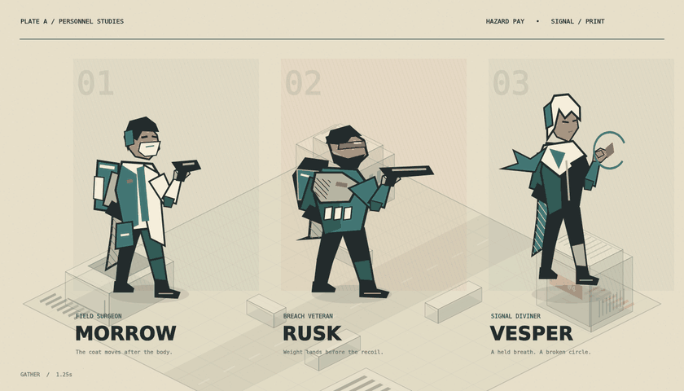
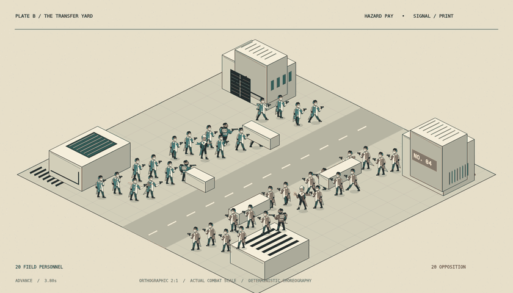
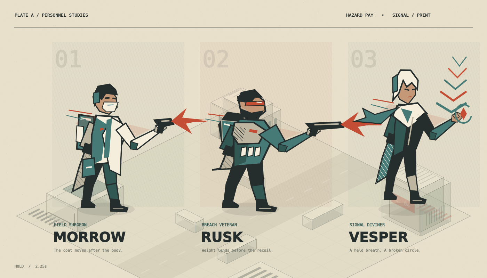
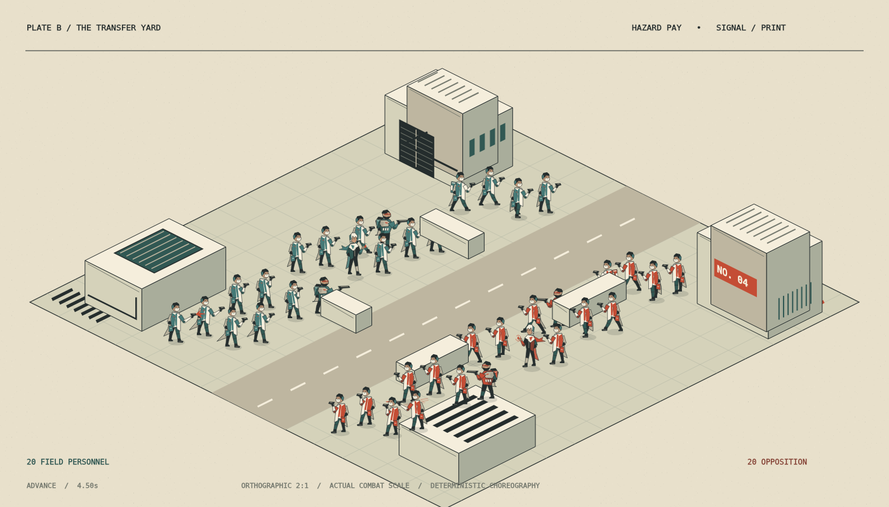
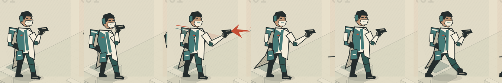

# SIGNAL / PRINT

A throwaway Hazard Pay art-direction branch: angular illustration rendered as a
three-ink field report. Original code-native geometry; no image-model output,
downloaded artwork, vector icon library, external fonts, or new dependencies.

## Review

```sh
corepack pnpm --filter @hazard-pay/webapp dev --port 5176
```

Open `/signal-print-prototype`. **Personnel** is the large character lineup;
**Forty bodies** places 20 units per faction on a fixed 2:1 dimetric industrial
yard. Both views use the same character geometry and pose functions.

- `?view=hero&freeze=1750`: anticipation, paused.
- `?view=hero&freeze=2250`: strike / graphic muzzle and psychic punctuation.
- `?view=hero&freeze=2667`: cloth follow-through after impact.
- `?view=crowd&freeze=4500`: combat-scale density and opposing silhouettes.
- Add `&capture=1` to remove the outer editorial masthead/footer. Scene and
  playback controls stay visible and operable for repeatable review.
- Play/Pause, **Step +1/12s**, and the labelled timeline are keyboard-accessible.
  Reduced-motion users start paused. Seeking is stateless and reproducible.

## Offline art gallery

These images are **offline native-Canvas renders of the actual `renderer.ts`
painter**, not browser screenshots. The browser could not reach this environment's
development server. Artwork, projection and sampled motion have been inspected;
the page's DOM layout, interaction and browser lifecycle have not been verified.











The full-size PNGs are 1400×800. GIFs are 840×480 with a fixed palette built from
the full hero sequence. [Capture metadata](gallery/capture-metadata.json) records
the exact times and native runtime version. Motion verification hashes the actual
actor-art crop, excluding all time labels/captions, and counts changed pixels
between adjacent frames. The six-panel strip makes the body acting directly
inspectable without relying on a changing clock.

To reproduce, install `@napi-rs/canvas` **outside this repository** and point
`CANVAS_MODULE` at its directory. Python 3 with Pillow is required for GIF encoding.
The script also recognizes Codex runtime dependencies via environment variables.

```sh
CANVAS_MODULE=/path/to/review-tools/node_modules/@napi-rs/canvas \
  node --import tsx apps/webapp/src/signal-print-prototype/capture.mjs
```

An optional positional argument changes the output directory. Temporary raw PNG
frames are deleted after successful encoding; the gallery keeps only curated
stills, two GIFs, the pose strip and metadata. No capture dependencies were added
to the application or lockfile.

## Lineage and the experiment

[PR90](https://github.com/arnavp103/hazard-pay/pull/90) supplies the question of
flat procedural character construction; [PR92](https://github.com/arnavp103/hazard-pay/pull/92)
supplies the graphic environment comparison. This branch moves those questions
toward a restrained screenprinted illustration system, rather than adopting either
prototype's assets. It is isolated from `/combat-sandbox` and `/match-proto`.

The repository's character and technofantasy reference boards inform exaggerated
held poses, uncommon silhouettes, tailored equipment, and a power effect belonging
to one individual. No reference artwork has been copied or vendored.

Three newly authored fighters:

| Fighter | Shape language | Motion cue |
| --- | --- | --- |
| Morrow, field surgeon | Surgical mask, split ivory overcoat, teal medical satchel | Narrow anticipation, forward jab, late coat hem |
| Rusk, breach veteran | Beard, red visor, broad back plate, ammunition blocks | Low center of mass, planted legs, punch and recoil |
| Vesper, signal diviner | White angular hair, dark tunic, interrupted teal scarf | Suspended body, hand-held broken orbit, delayed fabric |

All geometry is authored in Canvas paths. Tapered limb volumes follow shoulder,
elbow, wrist, hip, knee and ankle endpoints; linework, hatching, material planes and
negative space supply the illustration. This is intentionally a different modality
from pixel sprites or a lit 3D figurine. The backdrop uses a cached paper-grain pass,
hard value grouping and orthographic industrial massing.

## Animation design

The 6.4-second sequence contains breath, gather, strike, hold, recover and advance.
Bodies use a 12-pose-per-second cadence. The attack compresses roughly 800ms of
anticipation into a 100ms extension; the impact shape drops out before fabric has
finished moving. The leg cycle keeps open limb gaps at small scale. A brief red
smear and broken graphic lines reinforce the strike without continuous glow.

`motion.ts` is stateless pose sampling plus the projection. `renderer.ts` owns all
original shapes and the battlefield. `signal-print.tsx` owns a cancellable frame
loop and playback state. Static background painting is cached per view; scene
rendering is throttled to the authored cadence, and a paused scene is not redrawn.

## Deliberate limits

- This is an art/motion proof, **not** an AI combat simulation. Crowd movement is a
  staggered repeating choreography; impacts do not calculate hits or damage.
- Three-quarter facing is authored once and mirrored for the opposing faction.
  It does not establish a complete eight-direction animation set.
- The lineup magnifies the same path geometry for inspection. Hatching and facial
  detail intentionally collapse into value masses at battlefield scale.
- Terrain has a fixed camera and minimal occlusion handling; no navmesh, collision,
  elevation transitions, cover mechanics, or production asset pipeline is claimed.
- Broad poses are shared among the three archetypes. Their gear, cloth shape and
  psychic lift differ, but individually authored full action libraries remain work.
- Color tokens are local to this isolated visual experiment, not a change to the
  production UI theme.

## Validation

- Root `corepack pnpm type-check` and `corepack pnpm lint`.
- Webapp tests, including deterministic wrapping, delayed cloth timing and exact
  2:1 ground-axis projection checks in `motion.test.ts`.
- Root `corepack pnpm test` requires the repository's Postgres service at
  `localhost:5433`; absent service blocks the existing database global setup.
- Native offline visual review of hero/crowd frames, actual actor-only pixel
  changes, and the motion strip. No browser verification is claimed.
