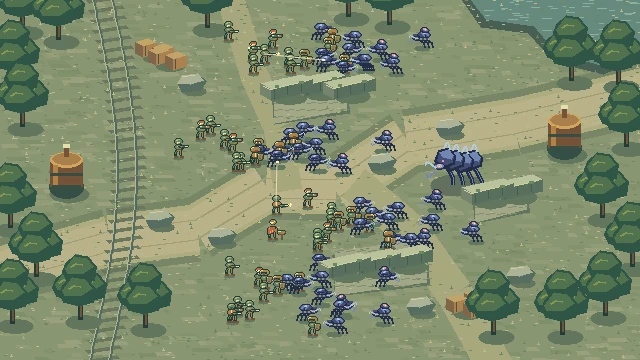
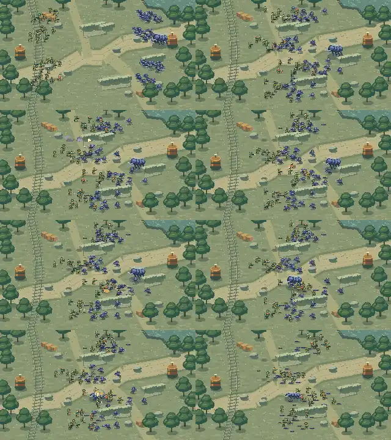

# Emberwatch — native pixel art study

Open `/prototype-emberwatch` after running `corepack pnpm --filter @hazard-pay/webapp dev`.



A new art direction: a sunlit, overgrown aqueduct occupied by a salvage crew and cobalt chitin creatures. Raster sprites are authored from pixel masks at native 640 × 360 resolution. Integer scaling preserves the pixel grid. This is an isolated art and animation prototype, not a replacement for the production battle renderer.

The 36-second encounter contains 48 combatants and six chapters. Three separated depth lanes keep the frontline, rifle line, and artillery readable. Captain Rook's rocket-assisted Hammerfall crosses lanes and triggers a group recoil; the matriarch's charge is answered by a coordinated rocket volley. Bodies, craters, and wreckage persist into the closing regroup.



## Assets and controls

- `author_sprites.py` authors the aqueduct, six roles × six poses × eight frames, and the matriarch atlas using Pillow. No generated imagery or old prototype art is used.
- `apps/webapp/public/emberwatch/` contains the actual PNG atlases loaded by the runtime.
- `apps/webapp/src/emberwatch/scene.ts` owns the deterministic choreography and painter.
- The route provides pause, replay, a seekable timeline, and chapter jumps. Reduced-motion preference starts the scene paused.
- `scene.test.ts` checks repeatable seeking, three occupied depth lanes, Hammerfall travel and reactions, and persistent casualties.

## Reproduce the media

Use Node 24+ for TypeScript stripping, Pillow for sprite authoring, `@napi-rs/canvas` for offline drawing, and FFmpeg for encoding. The capture imports the actual runtime painter. It does not use a separate mock scene.

```sh
python docs/art-direction/emberwatch/author_sprites.py
node docs/art-direction/emberwatch/render.mjs --film
```

`@napi-rs/canvas` may be installed in a separate tooling environment; set `CODEX_PRIMARY_RUNTIME_NODE_MODULES` to that environment's `node_modules` folder if it is not locally resolvable. This does not require changing the project's dependency lockfile.

Outputs go to `docs/art-direction/emberwatch/captures/`, or the absolute path in `EMBERWATCH_CAPTURE_DIR`. The full film is 36 seconds at 30 fps, rendered at 640 × 360 then upscaled to 1280 × 720 with nearest-neighbor filtering. PNG stills show uncompressed pixels. Compressed WebP review stills in this document are only previews; the game uses the original PNG atlases.

The movie is delivered separately to avoid committing a large binary. To export the committed preview stills from the PNG captures:

```sh
python - <<'PY'
from PIL import Image
from pathlib import Path
p = Path('docs/art-direction/emberwatch')
Image.open(p/'captures/poster.png').save(p/'poster.webp', quality=90, method=6)
Image.open(p/'captures/contact-sheet.png').resize((768,648), Image.Resampling.NEAREST).save(p/'contact-sheet.webp', quality=55, method=6)
PY
```

Validation covers deterministic state tests, TypeScript, lint, and production compilation. Offline media capture verifies the painter and encoded frames; it does not claim browser performance or interaction coverage. Art direction remains a review decision.

## Validation record

Root TypeScript and lint pass. All 138 webapp tests pass. Production Vite build and shell prerender pass. The full monorepo test command was attempted, but database integration suites cannot connect to the local Postgres service on port 5433 in this environment. That gate is not claimed as passing.
