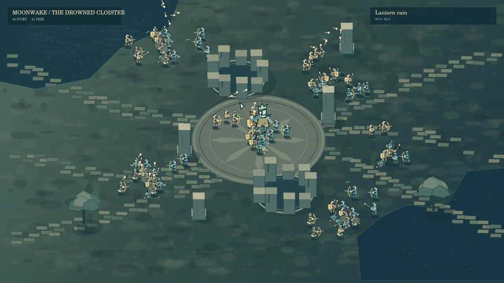
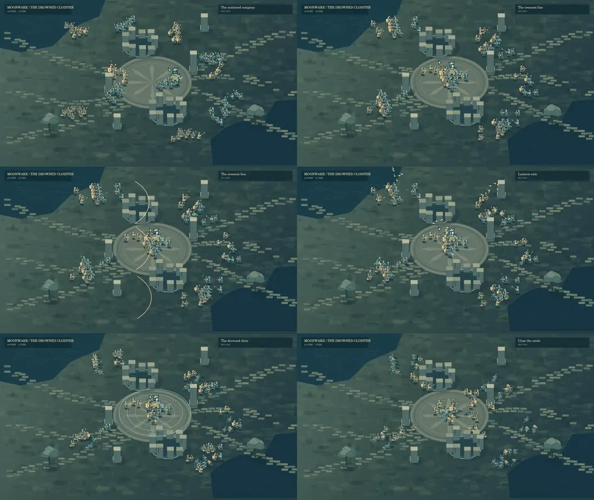
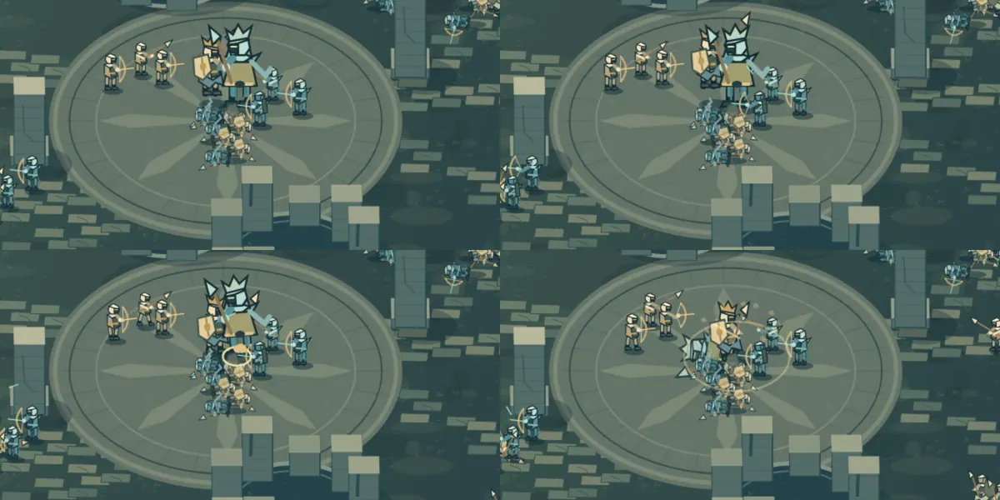

# Moonwake — elevated 2.5D battlefield

The previous side-on illustration missed the intended presentation. This revision replaces its staging and character scale with small upright figures moving across an elevated, fully visible ground plane, in the spatial language of Hero's Hour. It remains original programmatic art: ivory shields, moonlit cloister masonry, lantern bows and drowned bell-keepers.

Open `/prototype-moonwake`. The isolated prototype has pause, replay, timeline scrubbing and five chapter jumps. Reduced-motion preference starts it paused. There is no backend or production battle dependency.

## What to review

- 88 units, six irregular engagement pockets and diagonal approaches. The captain is 1.48× troop scale; the bell-keeper is 2.05×. The battle uses one fixed elevated camera throughout.
- World X/Y positions project to ground footpoints. Units and individual ruin segments share depth sorting. Top helmet planes, front/back equipment visibility, ground shadows, obstacle footprints and independently elevated projectiles establish the 2.5D view.
- Visibility-graph navigation avoids the physical ruins; local separation keeps individual movement. Wings converge after their local engagements. Deaths remain at ground positions.
- 42 seconds: scattered advance; shield-company crescents; 32 staggered lantern projectiles; the bell-keeper's expanding tide; final converging attack and captain's overhead cut. Jointed walking, weapon anticipation/release, shield raising, bow draw, flinch and persistent collapse are separate poses.







## Reproduce the film

`render.mjs` calls the exact runtime painter and deterministic timeline with `@napi-rs/canvas`. In this workspace that package is supplied by `CODEX_PRIMARY_RUNTIME_NODE_MODULES`; it is not a new game dependency. Node 24 can run the TypeScript imports directly. FFmpeg encodes the full 1280×720, 24 fps, 1008-frame film. Six sequential seven-second chunks bound native Canvas memory, then concatenate without re-encoding:

```sh
node --expose-gc docs/art-direction/moonwake/render.mjs --video
```

The generated MP4 and full-resolution PNG captures are review artifacts, not tracked game assets. The compact WebP gallery is tracked. This is an offline capture of the runtime painter, not browser interaction or performance validation.

## Validation and limits

Timeline tests check all 88 footprints at 307 interpolated times, visibility-graph segment clearance around a ruin, world-height projection, substantial motion along both axes, deterministic backwards scrubbing and persistent casualties. Root typecheck, root lint, webapp tests and production build are run for the revision. Full monorepo tests were attempted and stop because Postgres on localhost:5433 is unavailable.

The battle is a deterministic authored study with local pursuit, separation and timed setpieces. It is not production combat AI. Vector silhouettes remain thin at very small display sizes, and the deliberately muted terrain is a taste question. Sound and interactive orders are outside this prototype.
