# Agent-artist reference board

This board gives the artist agent and the cold critic a shared visual frame
for Hazard Pay. It is a set of **references**, not a recipe for one approved
look. Direction B is the current starting point, not an immutable palette.

## How to use the board

- Include the **world anchors** by default. They establish the current
  Direction B baseline and the match surface the art must live inside.
- For an explicit art-direction experiment, state what is changing and treat
  the affected anchor as a comparison point rather than a constraint.
- Select only the **exploration references** relevant to the current brief.
  They are swappable prompts for experimentation, not permanent canon.
- Keep the exploration library broad, but give an individual art brief only a
  small, intentional subset. More references create more available directions;
  they must not become a checklist every artifact has to satisfy.
- Read each caption as a narrow instruction: pull the named quality, not the
  whole image. Do not average every reference into one style.
- Give the artist and cold critic the same selected images and captions. The
  critic sees the artifact and references, never the generation transcript.
- A new cofounder-supplied image can replace or extend the exploration set at
  any time. Its caption must say both what to learn and what not to inherit.

Technofantasy may be genuinely supernatural or deliberately ambiguous.
Nothing on this board requires esper abilities to come from hardware.

## Current style hypothesis: comic-book pixel art

The UI's clipped stickers, hard shadows, graphic shapes, and oversized type
promote a cartoony, comic-book world. Match and overworld art can marry that
language with pixel art through:

- ink-like outer contours and clean internal separations;
- flat, cel-shaded color clusters instead of smooth rendering;
- exaggerated silhouettes and key poses that read before small detail;
- selective halftone, dither, or offset-print texture at focal moments;
- punchy character-local accents rather than one global accent color.

This is a hypothesis to test, not a canon to enforce. Prefer the sprite detail
and pose readability of **Warped City** over ultra-low-resolution roguelike or
icon-like rendering. Pixelation should shape the drawing, not erase the comic
character.

### Production-language shorthand

Use **comic-book pixel art** for the overall direction and **medium-resolution
illustrative pixel sprites** when a production brief needs more precision.

The phrase deliberately combines two compatible ideas rather than claiming one
specific authoring format:

- **Kingdom Rush:** illustrated cartoon sprites—bold contour, caricatured
  silhouette, large color zones, and a few equipment or facial cues that survive
  a distant camera.
- **Dwarf Fortress Premium:** layered, palette-driven pixel sprites—identity
  assembled from hair, armor, equipment, body features, and material palettes
  without pretending every character must fit a tiny generic icon.

For Hazard Pay, translate the Kingdom Rush character grammar into deliberate pixel
clusters at the Warped City side of the density range. Layering is a useful system,
not a cap on bespoke art: rare espers and special cyberarmor may require singular
silhouettes, effects, and animation.

Do not call the target vector sprites, skeletal sprites, cutout animation, or
hand-drawn frame-by-frame animation until an actual authoring pipeline is tested.

## Palette experiments

Direction B's warm plum-black, magenta, and acid chartreuse are the current
comparison baseline. The chartreuse is already overrepresented in the UI and
should not be copied into every asset by default.

A brief may replace or rebalance any of these colors. For palette experiments:

1. keep composition, value hierarchy, and subject matter constant;
2. vary the palette as the named experimental variable;
3. show the alternatives together at actual match scale;
4. have the critic judge readability, mood, and UI coexistence against the
   brief—not conformity to the existing chartreuse.

## World anchors

### Direction B overview

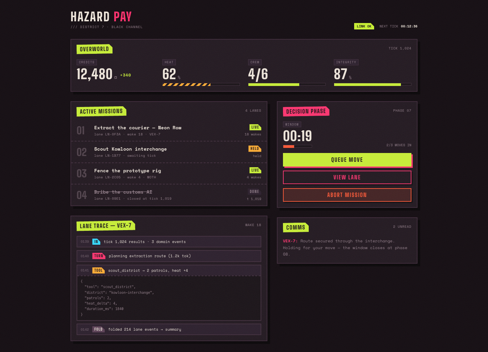

**Use:** `grime`, `materials`, `graphic language`. Grain, hard offset shadows,
clipped stickers, strong contour shapes, and hazard markings establish the
current comic-book baseline. Its palette is a comparison point for deliberate
experiments.

**Do not inherit:** UI typography or panel geometry as sprite anatomy or
environment ornament. Do not promote acid chartreuse into a universal art
accent.

Source: Hazard Pay's accepted Direction B prototype at commit
`42c00d9a3b5f8c48e4859eb35b1f5ff1fcc71f90`.

### Direction B match HUD

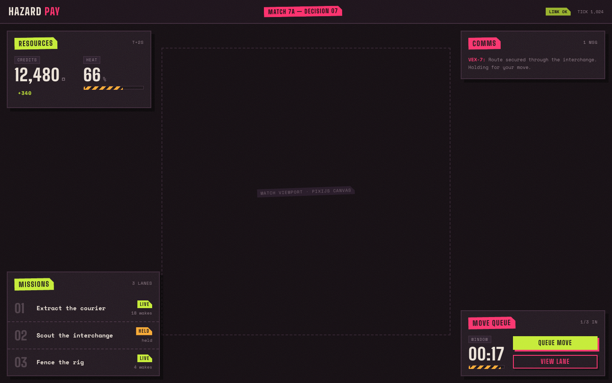

**Use:** `composition`, `contrast`. The match art occupies the loud central
field while remaining legible beside the magenta/chartreuse HUD.

**Do not inherit:** the empty canvas or dotted boundary; those mark the
integration seam, not the final scene.

Source: Hazard Pay's accepted Direction B prototype at commit
`42c00d9a3b5f8c48e4859eb35b1f5ff1fcc71f90`.

### Current match prototype

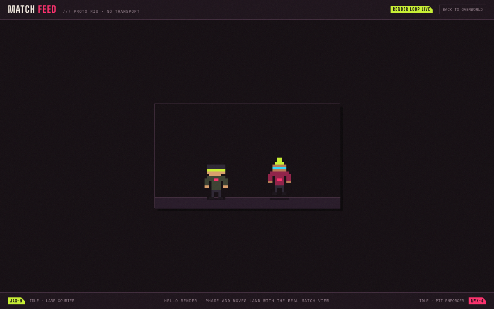

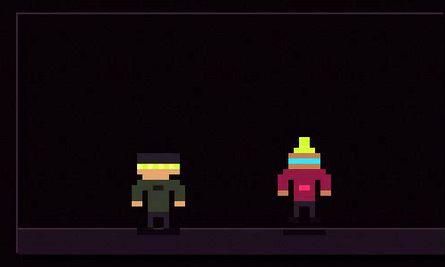

**Use:** `scale`, `readability`, `from-here`. Preserve instant unit separation
at the existing match-view scale and validate stills in motion.

**Do not inherit:** placeholder block anatomy, flat stage, or minimal motion as
an aesthetic target.

Source: Hazard Pay `screenshots/match-proto-screen.png` and
`screenshots/match-proto-idle.gif`.

## Exploration references

### Warped City environment

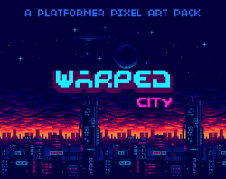

**Use:** `palette`, `environment`, `grime`. Dark massing, selective saturated
light, and layered urban depth keep a hostile city readable.

**Do not inherit:** its blue-first palette, skyline, or side-scroller
composition. Direction B remains the color anchor.

Source: [Warped City by ansimuz](https://opengameart.org/content/warped-city),
CC0/public domain.

### Cyberpunk Street Environment

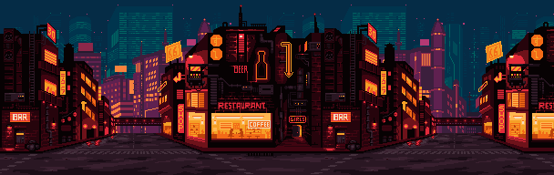

**Use:** `environment`, `grime`, `depth`, `palette`. Three strong depth bands,
dark storefront/machinery masses, rain, and restrained warm windows create a
readable street with more detail than a low-pixel tileset.

**Do not inherit:** the near-monochrome blue treatment, mirrored repetition, or
side-scroller camera.

Source: [Cyberpunk Street Environment by ansimuz](https://opengameart.org/content/cyberpunk-street-environment),
CC BY 3.0; attribute `ansimuz.com`.

### Industrial Zone

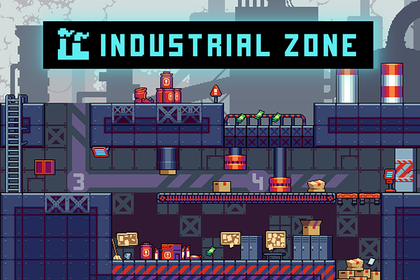

**Use:** `environment`, `comic-book`, `palette`. Large industrial silhouettes,
bold hazard shapes, readable props, and orange-red machinery against cool steel
show how a cartoony environment can remain materially specific.

**Do not inherit:** generic platform ledges, soft glow, or equal emphasis on
every prop.

Source: [Industrial Zone Tileset by CraftPix.net 2D Game Assets](https://opengameart.org/content/industrial-zone-tileset),
OGA-BY 3.0.

### Post-apocalyptic palette range

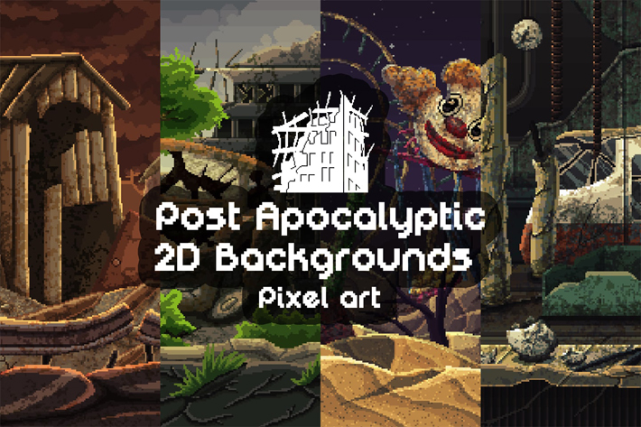

**Use:** `palette`, `environment`, `grime`. Rust, dusty orange, slate blue,
faded teal, and dirty concrete offer several cyberpunk-adjacent families that
do not rely on chartreuse.

**Do not inherit:** apocalypse emptiness, desert-only worldbuilding, or haze in
place of clean value grouping.

Source: [Post Apocalyptic Pixel Art Backgrounds by CraftPix.net 2D Game Assets](https://opengameart.org/content/post-apocalyptic-pixel-art-backgrounds),
OGA-BY 3.0.

### Street and market vocabulary

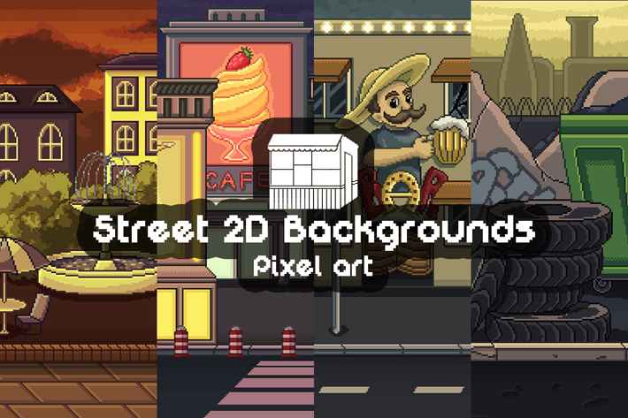

**Use:** `environment`, `comic-book`, `palette`. Storefronts, awnings, signs,
street furniture, and warm neighborhood palettes help districts feel socially
specific rather than generically cyberpunk.

**Do not inherit:** quaint cleanliness, stock storefronts, or foreground clutter
that leaves no quiet combat plane.

Source: [Pixel Art Street Backgrounds by CraftPix.net 2D Game Assets](https://opengameart.org/content/pixel-art-street-backgrounds),
OGA-BY 3.0.

### Grey-purple city palette

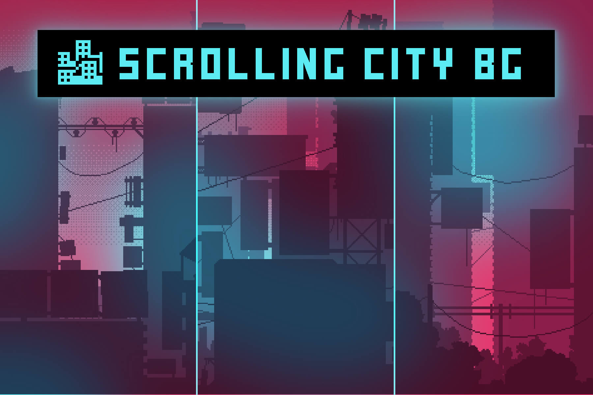

**Use:** `palette`, `environment`. Low-saturation lavender, grey, navy, and
localized cyan/magenta show that infrastructure and silhouette can carry the
cyberpunk identity while saturated color is reserved for units and effects.

**Do not inherit:** low-contrast fog everywhere or a permanent power-cut mood.

Source: [Cyberpunk Backgrounds Pixel Art by CraftPix.net 2D Game Assets](https://opengameart.org/content/cyberpunk-backgrounds-pixel-art),
OGA-BY 3.0.

### Warped City animation sheet

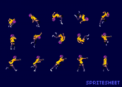

**Use:** `outlines`, `animation`. Clear action silhouettes and small bright
focal clusters remain readable across a large pose vocabulary. This is the
preferred side of the pixel-density range: enough pixels for expressive poses,
materials, and comic character.

**Do not inherit:** lanky platformer proportions or literal costumes. Avoid
dropping toward ultra-low-resolution roguelike or icon-like rendering.

Source: [Warped City by ansimuz](https://opengameart.org/content/warped-city),
CC0/public domain.

### Cyberpunk portraits

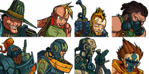

**Use:** `comic-book`, `outlines`, `characters`. Decisive contour breaks, large
cel-like shadow shapes, expressive faces, and character-local palettes bridge
sprite art, dialogue portraits, and the UI's graphic language.

**Do not inherit:** portrait-only proportions, individual costumes as faction
canon, or the exact framing.

Source: [Cyberpunk Portraits by Hyptosis](https://opengameart.org/content/cyberpunk-portraits),
CC0/public domain.

### Gothicvania character and creature range

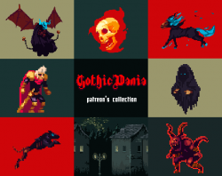

**Use:** `technofantasy`, `outlines`, `animation`. Dark contours, economical
cel-like clusters, and varied humanoid/creature silhouettes show how mythic
charge can survive at a Warped City-adjacent density.

**Do not inherit:** medieval costumes, Castlevania staging, or a uniformly
gloomy palette. Translate the charge, not the genre furniture.

Source: [Gothicvania Patreon's Collection by ansimuz](https://opengameart.org/content/gothicvania-patreons-collection),
CC0/public domain.

### Cyberarmor animation coverage

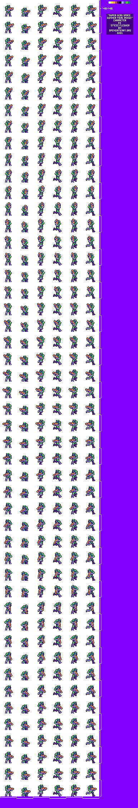

**Use:** `cyberarmor`, `animation`, `production`. A broad sheet of stance,
movement, aim, attack, reaction, and transition states demonstrates how armor
material separation and pose coverage can coexist.

**Do not inherit:** mass-issued space-marine identity, tiny helmeted faces,
fixed rifles, or its palette/rendering density as the visual target.

Source: [Super Dead Space Gunner Merc Redux by Emcee Flesher](https://opengameart.org/content/super-dead-space-gunner-merc-redux-platform-shmup-hero),
CC BY 4.0; derived-work attribution is recorded on the source page.

### Cyberarmor animation range

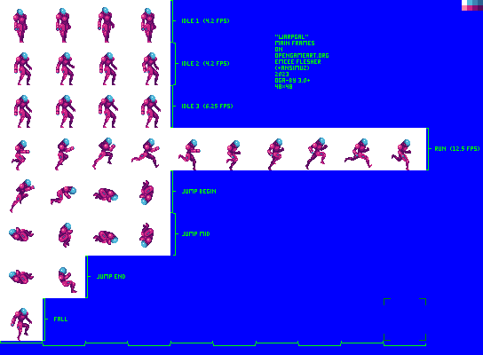

**Use:** `outlines`, `animation`, `technofantasy`. Specialized armor can carry
a distinct silhouette through idle, movement, jump, fall, and combat poses.

**Do not inherit:** this particular space suit, weapon, palette, or animation
inventory. Hazard Pay's rare cyberarmor should feel invested-in rather than
mass-issued.

Source: [Platform Shmup Hero: Warpgal by Emcee Flesher](https://opengameart.org/content/platform-shmup-hero-warpgal),
OGA-BY 3.0; based on an original CC0 character by ansimuz.

### Technofantasy effects range

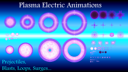

**Use:** `animation`, `technofantasy`. Plasma, vortex, gravity, and energy
shapes demonstrate a range that can read as supernatural, technological, or
deliberately ambiguous after palette and timing changes.

**Do not inherit:** the cyan-first palette, smooth glow treatment, or an
assumption that every esper uses the same effect language.

Source: [Plasma Electric Effect Animations by Reactorcore](https://opengameart.org/content/plasma-electric-effect-animations),
CC0/public domain.

### Super Clone Cyborg animation sheet

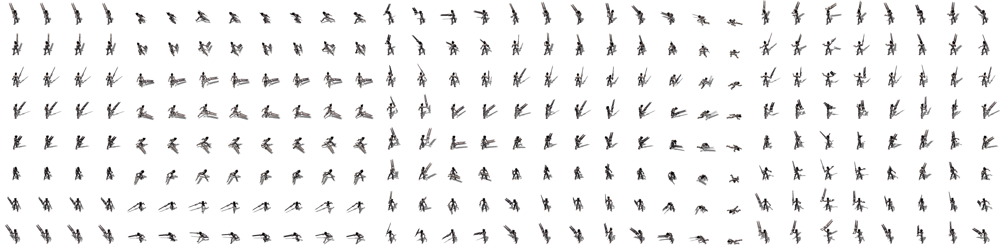

**Use:** `cyberarmor`, `animation`, `production`. Extensive directional casting,
melee, ranged, block, movement, and reaction coverage makes the production cost of
a highly equipped combatant visible. Equipment and power emitters remain distinct
through many actions.

**Do not inherit:** pre-rendered anatomy, tiny isometric rendering, literal gear,
or a requirement that esper phenomena be technological. This is an animation
inventory reference, not the rendering-density target.

Source: [Super Clone Cyborg by Metapixelatron](https://opengameart.org/node/101322),
CC0/public domain.

### Gothicvania Magic Pack 9

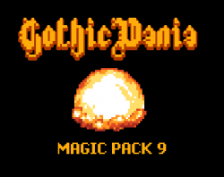

**Use:** `technofantasy`, `animation`, `effects`. Crisp anticipation, expansion,
and impact shapes show how a compact effect can read with comic punctuation and be
recolored into character-specific esper families.

**Do not inherit:** elemental spell taxonomy, medieval framing, orange/yellow as a
default power palette, or these shapes without adapting them to a character.

Source: [Gothicvania Magic Pack 9 by ansimuz](https://opengameart.org/content/gothicvania-magic-pack-9),
CC0/public domain.

## Link-only style studies

These commercial works are high-value visual comparisons, but their images are
not vendored into this repository. Follow the official source when a brief
selects one.

### Kingdom Rush 5: Alliance

**Use:** `characters`, `comic-book`, `outlines`, `palette`. Illustrated cartoon
sprites use heavy silhouette exaggeration, contour-bound color zones, and a few
large identity cues that stay readable at battlefield scale. Saturated character
palettes work over a relatively neutral playfield without a global yellow cast.

**Do not inherit:** medieval subject matter, chibi proportions, rubbery comedy in
every pose, or an unverified assumption about vector, skeletal, or frame-by-frame
production.

Official sources: [Ironhide game page](https://www.ironhidegames.com/Games/kingdom-rush-alliance)
and [Ironhide series press kit](https://play.kingdomrush.com/kingdom-rush-presskit).
Keep this copyrighted reference link-only.

### Dwarf Fortress Premium

**Use:** `characters`, `system`, `layers`, `palette`. Its static pixel sprites use
layer sets and material palettes to combine hair, equipment, armor, and body
features. Figures can cross their nominal map cell when identity demands it.

**Do not inherit:** low-detail map scale, square framing, information density,
static presentation, or the idea that every GUI element must use the same pixel
resolution.

Official sources: [Dwarf Fortress on Steam](https://store.steampowered.com/app/975370/Dwarf_Fortress/)
and [Bay 12 development log](https://www.bay12games.com/dwarves/). Keep the Premium
sprite pack link-only; moddability is not a permissive art license.

### Huntdown

**Use:** `comic-book`, `cyberpunk`, `grime`, `palette`. A strong marriage of
hand-painted 16-bit pixel art, graphic character silhouettes, neon-soaked
streets, graffiti, and hard-boiled comic exaggeration.

**Do not inherit:** side-scroller staging, its 1980s nostalgia wholesale, or
an obligation to make every scene neon-heavy.

Official source: [Huntdown press room](https://huntdown.com/press/). The press
room permits proportional use of its copyrighted press images; keep this
reference link-only and unmodified.

### Teenage Mutant Ninja Turtles: Shredder's Revenge

**Use:** `comic-book`, `outlines`, `animation`, `palette`. Full-color pixel art
preserves cartoon identity through strong contours, pose exaggeration, clean
color blocks, and character-specific palettes. This is direct evidence that
cartoon/comic language and pixel art can reinforce each other.

**Do not inherit:** licensed character shapes, toyetic brightness, or the
specific 1987-cartoon palette.

Official source: [Dotemu press kit](https://www.dotemu.com/PressKit/project/Games/TeenageMutantNinjaTurtlesShreddersRevenge).
Keep this copyrighted reference link-only.

### Metal Slug Tactics

**Use:** `outlines`, `animation`, `environment`, `comic-book`. Detailed,
expressive pixel characters coexist with tactical-scale environments through
bold poses, clustered shading, and selective visual effects.

**Do not inherit:** military caricatures, isometric camera, or dense battlefield
clutter as requirements.

Official source: [Dotemu press kit](https://www.dotemu.com/PressKit/project/Games/MetalSlugTactics).
Keep this copyrighted reference link-only.

### MARVEL Cosmic Invasion

**Use:** `comic-book`, `characters`, `technofantasy`, `animation`. Ink-minded
contours, superhero-scale poses, character-local palettes, and readable powers
are the clearest high-end example of comic language translated into pixels.

**Do not inherit:** Marvel anatomy, costumes, cosmic-primary palette, or
constant super-move intensity.

Official source: [Dotemu press kit](https://www.dotemu.com/PressKit/project/Games/MarvelCosmicInvasion).
Keep this copyrighted reference link-only.

### ANNO: Mutationem

**Use:** `characters`, `cyberpunk`, `density`, `palette`. Detailed,
fashion-conscious pixel characters retain readable faces and clothing inside
dimensional cyberpunk lighting without defaulting to yellow/magenta neon.

**Do not inherit:** anime anatomy, 2.5D rendering, bloom, or its exact fashion
language.

Official source: [Nintendo product page](https://www.nintendo.com/US/store/products/anno-mutationem-switch/).
Keep this copyrighted reference link-only.

### Narita Boy

**Use:** `technofantasy`, `comic-book`, `effects`. Mythic silhouettes, graphic
weapon arcs, strange creatures, and a restrained scene palette show how powers
can feel supernatural without importing medieval realism.

**Do not inherit:** lanky hero proportions, CRT nostalgia, metaphysical-computer
lore, or one permanent tricolor system.

Official source: [Team17 game page](https://www.team17.com/games/narita-boy).
Keep this copyrighted reference link-only.

### REPLACED

**Use:** `environment`, `depth`, `palette`. Large near-black contour masses,
localized red/cyan/warm-white light, haze, and weather create cinematic depth
while keeping a small character readable.

**Do not inherit:** realistic proportions, muddy bloom, or alternate-1980s
iconography as world canon.

Official source: [REPLACED](https://playreplaced.com/). Keep this copyrighted
reference link-only.

### The Last Night

**Use:** `environment`, `depth`, `cyberpunk`. Dense street activity and
occlusion remain organized into clear planes; pixel assets coexist with modern
light, reflections, and volumetrics.

**Do not inherit:** tiny actors, excessive post-processing, or rain-soaked neon
canyons as the only city type.

Official source: [Odd Tales](https://oddtales.net/thelastnight/). Keep this
copyrighted reference link-only.

### Eastward

**Use:** `environment`, `comic-book`, `palette`, `density`. Illustrated pixel
clusters, rounded shapes, local palettes, and high detail prove that cartoony
does not mean low-resolution or flat.

**Do not inherit:** cozy whimsy, pastoral color as a universal mood, or its
adventure-camera scale unchanged.

Official source: [Chucklefish introduction](https://chucklefish.org/blog/introducing-eastward-by-pixpil/).
Keep this copyrighted reference link-only.

### The Red Strings Club

**Use:** `palette`, `interiors`, `cyberpunk`. Coral, violet, magenta, and deep
navy create bold social interiors without chartreuse; light pools and prop
silhouettes give each room a compact color script.

**Do not inherit:** bar-specific motifs, dialogue framing, or magenta as the
next universal accent.

Official source: [Devolver Digital game page](https://www.devolverdigital.com/games/the-red-strings-club).
Keep this copyrighted reference link-only.

### Katana ZERO

**Use:** `animation`, `palette`, `comic-book`. Acrobatic key poses, slash trails,
hit-pause, black silhouettes, and decisive color blocks frame action like comic
panels.

**Do not inherit:** tiny protagonist scale, glitch effects everywhere, or
magenta/teal as mandatory shorthand.

Official source: [Devolver Digital game page](https://www.devolverdigital.com/games/katana-zero).
Keep this copyrighted reference link-only.

### Read Only Memories: NEURODIVER

**Use:** `espers`, `characters`, `technofantasy`. A rare, institutionally supported
esper and an expressive portrait/interface language show investment without
reducing the underlying power to cheap consumer hardware.

**Do not inherit:** point-and-click staging, literal memory-diving mechanics, or a
requirement that every esper use an amplifier or companion.

Official source: [Steam product page](https://store.steampowered.com/app/1293910/Read_Only_Memories_NEURODIVER/).
Keep this copyrighted reference link-only.

### Star Renegades

**Use:** `cyberarmor`, `characters`, `technofantasy`, `effects`. Tailored armor,
dense expressive sprites, sharp material breaks, and large silhouette-breaking
powers show premium gear and comic spectacle in the same pixel language.

**Do not inherit:** universal heroic gloss, bloom on every surface, or effects so
large that autobattler state disappears.

Official source: [Steam product page](https://store.steampowered.com/app/651670/Star_Renegades/).
Keep this copyrighted reference link-only.

### CrossCode

**Use:** `animation`, `technofantasy`, `comic-book`. Anticipation, held key poses,
graphic arcs, afterimages, and impact timing make powers forceful while preserving
crisp clusters and character identity.

**Do not inherit:** elemental-mode taxonomy, action-RPG camera scale, or continuous
projectile clutter.

Official source: [Radical Fish Games press kit](https://www.radicalfishgames.com/presskit/sheet.php?p=crosscode).
Keep this copyrighted reference link-only.

### SANABI

**Use:** `animation`, `cyberarmor`, `comic-book`. Silhouette-breaking cybernetic
motion, anticipation, follow-through, speed shapes, and impact punctuation give
pixel animation comic-book force.

**Do not inherit:** platformer speed, a prosthetic as every fighter's identity, or
motion trails that obscure tactical state.

Official source: [Steam product page](https://store.steampowered.com/app/1562700/SANABI/).
Keep this copyrighted reference link-only.

### Hyper Light Drifter

**Use:** `technofantasy`, `palette`, `ambiguity`. Impossible energy, illness, and
technology coexist without explanatory clutter; saturated effects stay localized
against dark value masses.

**Do not inherit:** tiny top-down scale, narrative opacity as a mandate, or a fixed
magenta/cyan power language.

Official source: [Steam product page](https://store.steampowered.com/app/257850/Hyper_Light_Drifter/).
Keep this copyrighted reference link-only.

### Jack Move

**Use:** `characters`, `comic-book`, `palette`, `UI`. Modern “hi-bit” pixels,
cartoon-forward acting, and personality-rich attacks connect detailed sprites to a
loud interface without requiring one global accent color.

**Do not inherit:** menu-heavy JRPG staging, cute tone everywhere, or software as
the required explanation for esper powers.

Official source: [Steam product page](https://store.steampowered.com/app/1099640/Jack_Move/).
Keep this copyrighted reference link-only.
