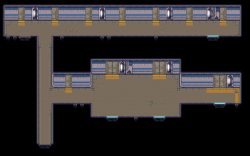

# Agent-artist reference board

This board gives the artist agent and the cold critic a shared visual frame
for Hazard Pay. It is a set of **references**, not a recipe for one approved
look.

## How to use the board

- Always include the **world anchors**. They establish Direction B and the
  match surface the art must live inside.
- Select only the **exploration references** relevant to the current brief.
  They are swappable prompts for experimentation, not permanent canon.
- Read each caption as a narrow instruction: pull the named quality, not the
  whole image. Do not average every reference into one style.
- Give the artist and cold critic the same selected images and captions. The
  critic sees the artifact and references, never the generation transcript.
- A new cofounder-supplied image can replace or extend the exploration set at
  any time. Its caption must say both what to learn and what not to inherit.

Technofantasy may be genuinely supernatural or deliberately ambiguous.
Nothing on this board requires esper abilities to come from hardware.

## World anchors

### Direction B overview

**Use:** `palette`, `grime`, `materials`. Warm plum-black foundation; hot
magenta and acid chartreuse accents; grain, hard offset shadows, clipped
stickers, and hazard markings.

**Do not inherit:** UI typography or panel geometry as sprite anatomy or
environment ornament.

Source: Hazard Pay's accepted Direction B prototype at commit
`42c00d9a3b5f8c48e4859eb35b1f5ff1fcc71f90`.

### Direction B match HUD

**Use:** `composition`, `contrast`. The match art occupies the loud central
field while remaining legible beside the magenta/chartreuse HUD.

**Do not inherit:** the empty canvas or dotted boundary; those mark the
integration seam, not the final scene.

Source: Hazard Pay's accepted Direction B prototype at commit
`42c00d9a3b5f8c48e4859eb35b1f5ff1fcc71f90`.

### Current match prototype

**Use:** `scale`, `readability`, `from-here`. Preserve instant unit separation
at the existing match-view scale and validate stills in motion.

**Do not inherit:** placeholder block anatomy, flat stage, or minimal motion as
an aesthetic target.

Source: Hazard Pay `screenshots/match-proto-screen.png` and
`screenshots/match-proto-idle.gif`.

## Exploration references

### Warped City environment

**Use:** `palette`, `environment`, `grime`. Dark massing, selective saturated
light, and layered urban depth keep a hostile city readable.

**Do not inherit:** its blue-first palette, skyline, or side-scroller
composition. Direction B remains the color anchor.

Source: [Warped City by ansimuz](https://opengameart.org/content/warped-city),
CC0/public domain.

### Warped City animation sheet

**Use:** `outlines`, `animation`. Clear action silhouettes and small bright
focal clusters remain readable across a large pose vocabulary.

**Do not inherit:** lanky platformer proportions or literal costumes.

Source: [Warped City by ansimuz](https://opengameart.org/content/warped-city),
CC0/public domain.

### Industrial tile vocabulary

**Use:** `environment`, `modularity`. A small alphabet of floors, ducts,
rails, panels, and breaks can produce reusable match-environment structure.

**Do not inherit:** the clean grey finish or generic spaceship identity; the
final surface needs Direction B's grime and color hierarchy.

Source: [24 X Scifi Cyberpunk Tiles by Hyptosis](https://opengameart.org/content/24-x-scifi-cyberpunk-tiles),
CC0/public domain.

### Cyberarmor animation range

**Use:** `outlines`, `animation`, `technofantasy`. Specialized armor can carry
a distinct silhouette through idle, movement, jump, fall, and combat poses.

**Do not inherit:** this particular space suit, weapon, palette, or animation
inventory. Hazard Pay's rare cyberarmor should feel invested-in rather than
mass-issued.

Source: [Platform Shmup Hero: Warpgal by Emcee Flesher](https://opengameart.org/content/platform-shmup-hero-warpgal),
OGA-BY 3.0; based on an original CC0 character by ansimuz.

### Technofantasy effects range

**Use:** `animation`, `technofantasy`. Plasma, vortex, gravity, and energy
shapes demonstrate a range that can read as supernatural, technological, or
deliberately ambiguous after palette and timing changes.

**Do not inherit:** the cyan-first palette, smooth glow treatment, or an
assumption that every esper uses the same effect language.

Source: [Plasma Electric Effect Animations by Reactorcore](https://opengameart.org/content/plasma-electric-effect-animations),
CC0/public domain.
