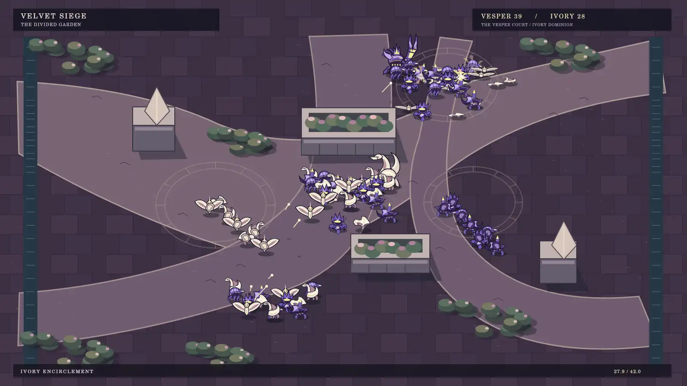
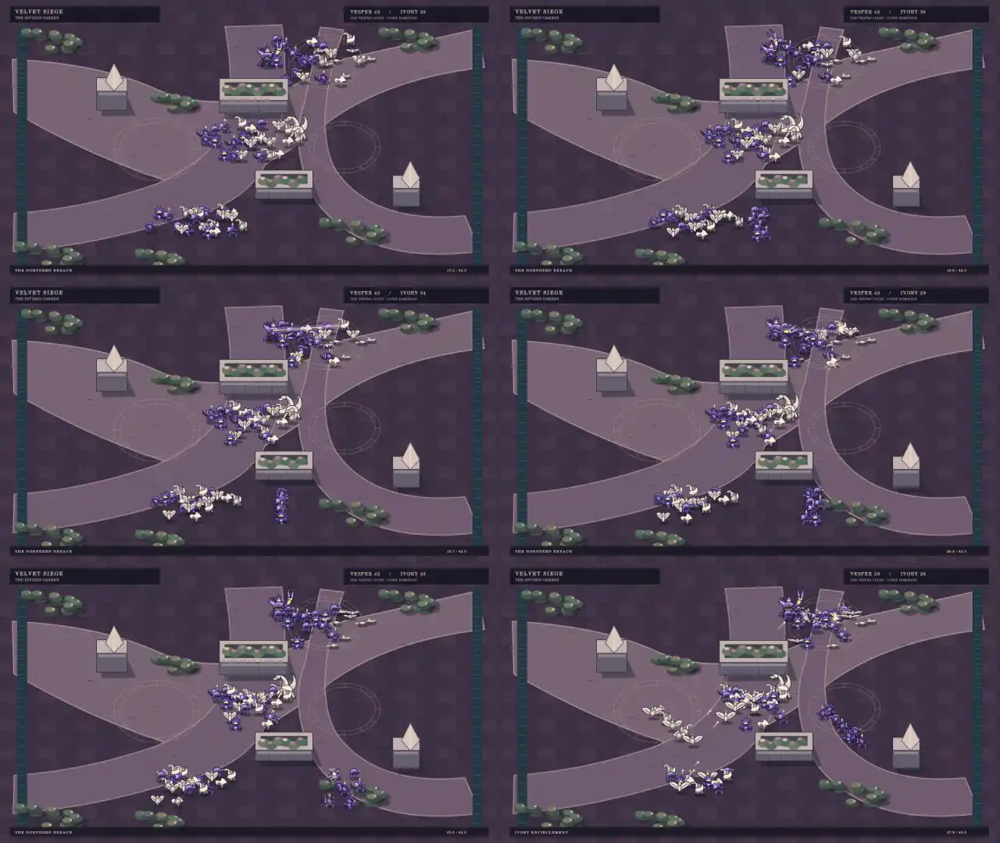

# Velvet Siege — the divided garden

An original **2.5D battlefield** for Hazard Pay at `/prototype-velvet-siege`: 84 small upright violet insect and ivory swan engines move across an elevated courtyard. This replaces the previous side-on staging. The camera stays fixed; commanders remain part of their armies.

The ground fills the frame. Three separated approaches meet along a diagonal front, and southern detachments turn north around raised gardens to attack the center from both sides. Individual positions are retained through deployment. Ground-space routes detour around solid structure footprints. Units and structures share depth sorting; northbound figures show rear carapaces. Projectile ground positions and airborne height are separate.





## Battle sequence

| Time | Action |
| --- | --- |
| 0–8s | 84 engines deploy through separate irregular approaches. |
| 8–13s | Braced mortar engines launch a staggered aerial constellation into the northern ivory detachment; impact markers, bursts and fixed wrecks show results. |
| 17–22s | The northern Regent opens its rail weapon, winds up, sweeps across the actual target positions and recovers. |
| 23–32s | Southern formations turn north around opposite sides of the structures, visibly switch to rear silhouettes, and converge on the center. Ivory artillery answers with a staggered barrage. |
| 34–40s | Surviving violet engines concentrate fire. Ivory machines collapse at their impact locations, including the Matriarch. |
| 40–42s | Thirty-one violet survivors hold a battlefield of persistent wrecks. |

This is deterministic choreography sampled from absolute time, not combat AI. It deliberately demonstrates ground-space staging, readable small units, occlusion and longer authored setpieces. Original Canvas paths supply every character and environment element; no image models, game assets or external packs are used.

## Source and controls

- `apps/webapp/src/velvet-siege/painting.ts`: art, orthographic projection, obstacle detours, depth sorting and battle timeline.
- `apps/webapp/src/velvet-siege/painting.test.ts`: footprint clearance throughout the timeline, unique staging positions, depth-crossing flanks, rear orientation, projectile height and fixed wreck invariants.
- `apps/webapp/src/velvet-siege/prototype.tsx`: pause, replay, seek, chapter and playback-speed controls. Reduced-motion users start paused.
- `render.mts`: identical runtime painter exported offline. It is not a browser recording or performance benchmark.

## Reproduce

Use Node 24, ffmpeg and the execution runtime's `@napi-rs/canvas`; set `CODEX_PRIMARY_RUNTIME_NODE_MODULES` to the directory containing that module. No project dependencies change.

```sh
node docs/art-direction/velvet-siege/render.mts --film
```

This writes review plates and `velvet-siege-25d-full.mp4`: 42 seconds, 1280×720, 24 fps, 1008 frames. Omit `--film` to regenerate only plates. Full films and PNG plates are generated review deliverables; the branch keeps compact WebP previews.

## Validation

Root type-check and zero-warning lint pass. The revised webapp suite passes: 12 files, 139 tests. The full encoded film was decoded and its 42-second / 1008-frame / 24-fps metadata verified. The production build and SPA prerender pass. The full local test command is blocked by the absent PostgreSQL service at localhost:5433; database-backed integration results are checked separately in remote CI. Browser interaction and runtime frame rate have not been measured. The production match and combat sandbox renderers remain unchanged.
