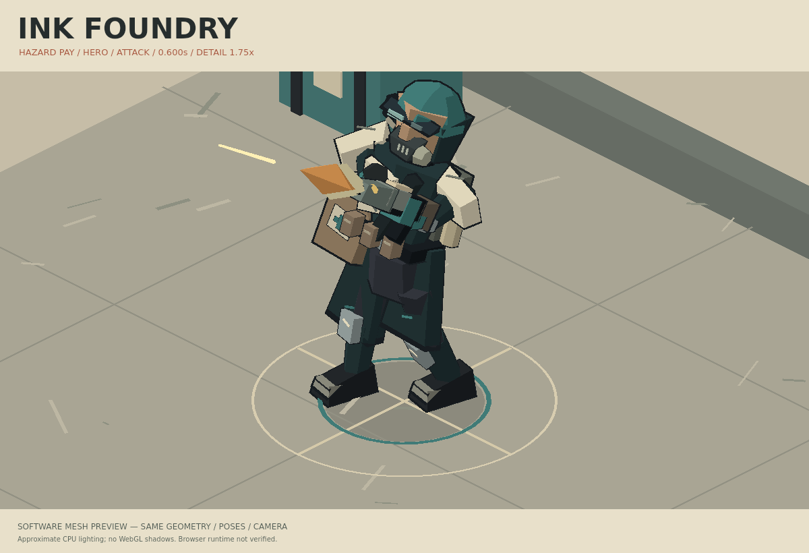
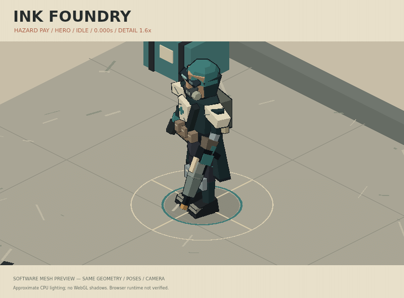
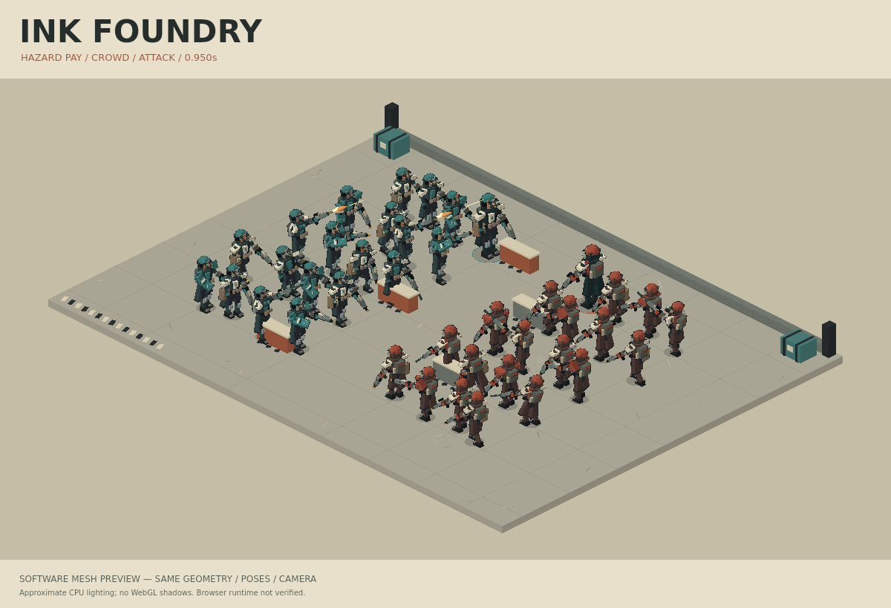
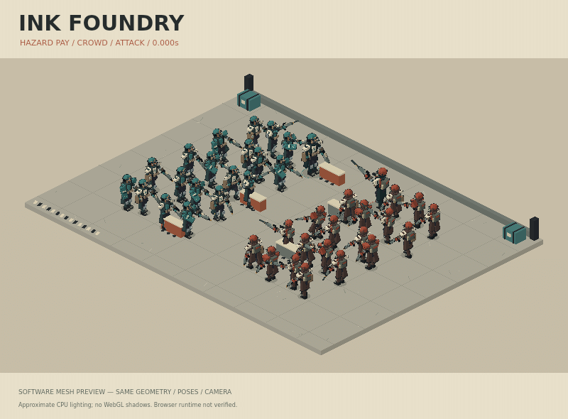
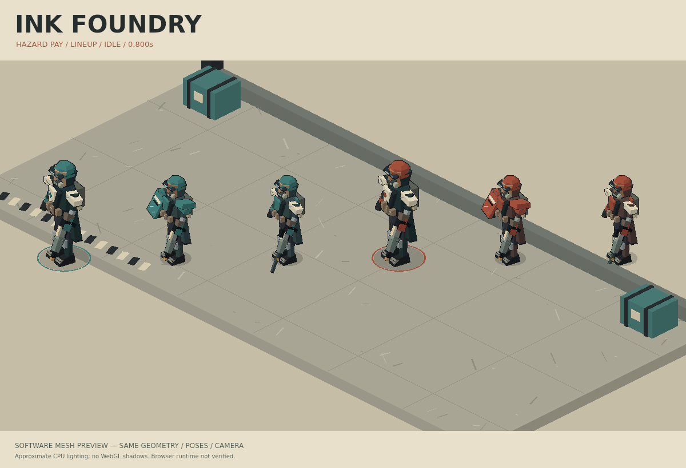
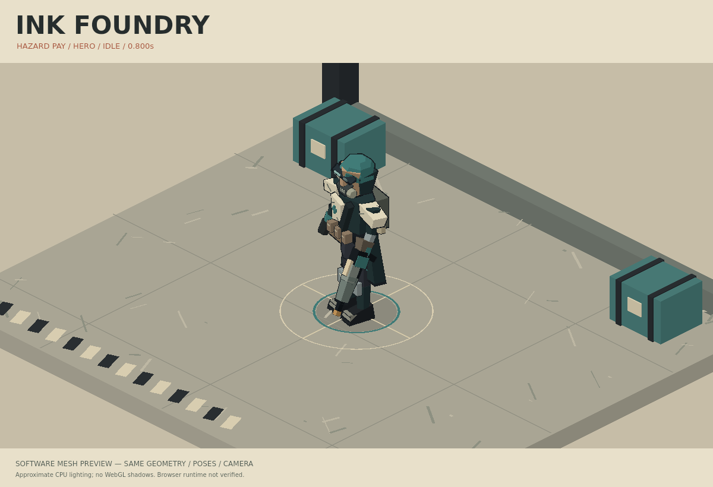
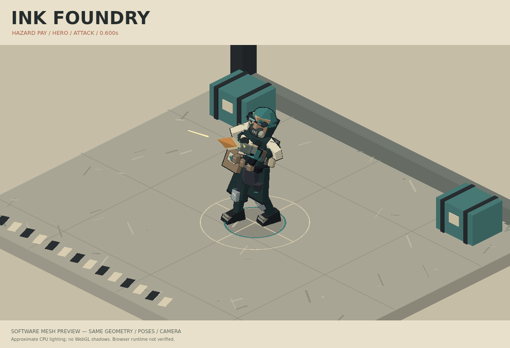
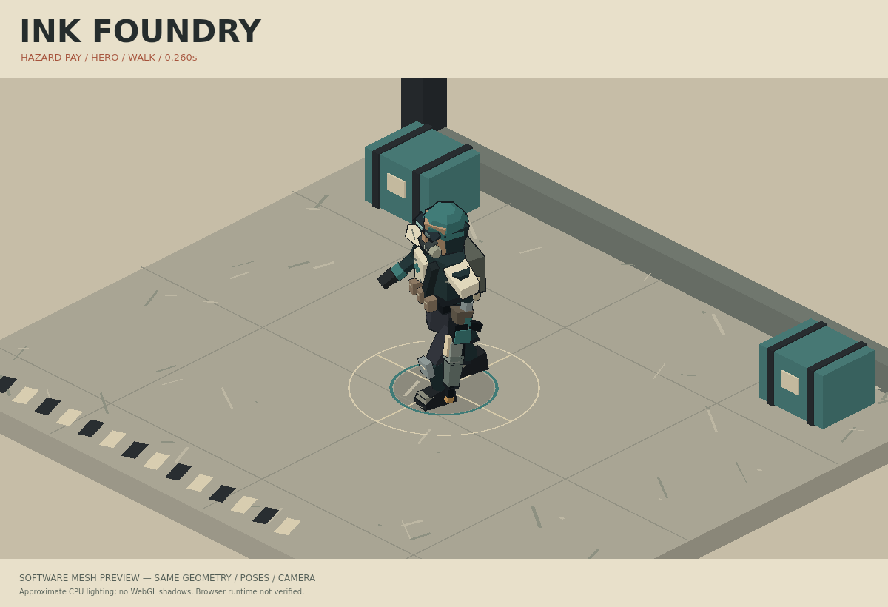
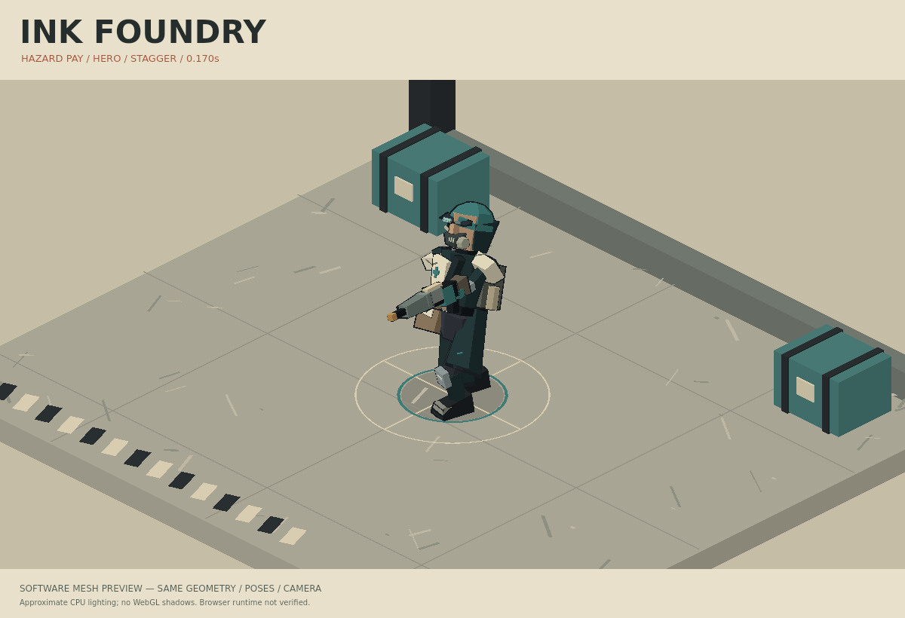

# Ink Foundry — software-rendered art gallery

These are **offline renders of the actual Three.js geometry and pose sampler**.
They are not browser screenshots. The CPU capture uses approximate toon lighting
and omits WebGL shadow maps. The interactive WebGL runtime remains unverified
because the available browser could not access the local development server.

## Character and motion



The first art pass read too much like stacked blocks. This revision replaces the
cap, shoulders, chest plate, respirator, coat and boots with sloped or faceted
surfaces; narrows the waist and joints; gives the medic a large asymmetric bag;
and adds a wider, offset attack stance. The detail plate uses 1.75× orthographic
zoom, retaining the same fixed 30°/45° camera angle.



The reel covers idle, walk, attack, turn and stagger at 1.6× zoom. Poses and shot
effects are sampled analytically, including the cloth tails and ejected casing.
The crowd remains a choreographed pose field, not simulated combat.

## Forty bodies and role lineup







## Controlled stills

| Idle | Attack |
| --- | --- |
|  |  |
| Walk | Stagger |
|  |  |

Normal stills retain the live hero framing. The motion manifest hashes only art
pixels, excluding the timestamp, and records distinct frames for every clip.

## What remains unresolved

The hands use rigid attachments rather than a fully constrained two-handed IK
grip. Cloth motion is stylized joint motion. Ground contact corrects sole height,
but locomotion is a treadmill study rather than world-space planted-foot motion.
The crowd's shared base construction still shows through the role variations.
GPU performance, WebGL material parity, UI behavior and accessibility need browser
verification in an environment that can reach the local server.

Reproduce from the repository root:

```sh
node --import tsx apps/webapp/src/ink-foundry/capture.mjs
```

Capture-only packages: `@napi-rs/canvas@0.1.100`, `sharp@0.35.4`; system font:
DejaVu Sans. See the [implementation README](../../../apps/webapp/src/ink-foundry/README.md)
for dependency resolution and source structure.
